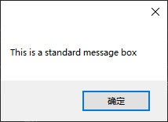

**1. 用变量存储值**

下面是一个变量声明的例子：

```basic
Dim strFirstName As String
```

**2. 使用过程来编写代码功能单元**

不你好值的过程使用关键字 Sub 声明，如下例所示：

```basic
Public Sub MyProcedure()
    ' The procedure's code goes here.
End Sub
```

声明有返回值的过程时使用关键字 Function。另外，在过程名的后面还指定了数据类型，它表示过程返回的数据类型：

```basic
Public Function MyProcedure() As String
    ' The procedure's code goes here.
End Function
```

如果过程接收参数，参数将位于括号中，同样也需要使用 As 来指定接受的数据类型：

```basic
Public Function CalculateTax(dblItemTotal As Double) As String
    ' The procedure's code goes here
End Function
```

Visual Basic 2010 提供了一种显示这种消息的简单方式：MessageBox.Show() 语句。下面是 MessageBox.Show() 语句的最简单形式：

```basic
MessageBox.Show("This is a standard message box")
```

