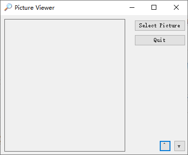

在代码中引用属性时，首先指定对象的名称，名称后紧跟着一个点号（.），然后是属性名，其语法如下：

```vb
ObjectName.Property
```

要设置属性的值，可使用等号（=）。例如：

```vb
btnClickMe.Left = 90
```

下面在 Picture Viewer 中添加两个按钮，其中一个按钮在它被单击时放大窗体，另一个则缩小窗体。



1. 双击工具箱中的 Button 工具，添加一个新按钮到窗体中。按如下设置该按钮的属性。

| 属性     | 值         |
| -------- | ---------- |
| Name     | btnEnlarge |
| Location | 326,257    |
| Size     | 24,23      |
| Text     | ^          |

2. 再次双击工具箱中的 Button 工具，添加一个新按钮到窗体中。按如下设置该按钮的属性：

| 属性     | 值        |
| -------- | --------- |
| Name     | btnShrink |
| Location | 356,257   |
| Size     | 24,23     |
| Text     | v         |

3. 双击图案为 "^" 的放大按钮，以访问其代码，然后输入下面的语句。输入后不要按回车键或添加空格。

```vb
Me.Width = Me.Width + 20
Me.Height = Me.Height + 20
```

> 注意，Me 只适用于基于对象的模块中，不能将其用于标准模块中。

4. 选择设计窗口顶部的 "ViewerForm.vb[设计]" 选项卡，重新显示窗口设计器。然后双击图案为 "v" 的按钮，以访问它的 Click 时间并添加如下代码：

```vb
Me.Width = Me.Width - 20
Me.Height = Me.Height - 20
```

