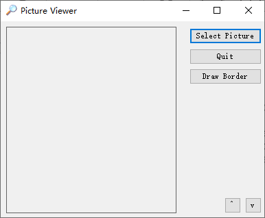

继续使用本章使用的 Picture Viewer 项目，现在在窗体中添加一个新按钮，并按如下设置其属性。

| 属性     | 值            |
| -------- | ------------- |
| Name     | btnDrawBorder |
| Location | w75,69        |
| Size     | 105,23        |
| Text     | Draw          |

双击 Draw Border 按钮以访问其 Click 事件。按如下输入代码：

```vb
Dim objGraphics As Graphics
objGraphics = Me.CreateGraphics
objGraphics.Clear(System.Drawing.SystemColors.Control)

objGraphics.DrawRectangle(System.Drawing.Pens.Blue, _
    picShowPicture.Left - 1, picShowPicture.Top - 1, _
    picShowPicture.Width + 1, picShowPicture.Height + 1)

objGraphics.Dispose()
```

> 注意，在这里，调用 DrawRectangle() 的语句有三行代码，其中前两行代码的末尾有一个下划线字符（_），也被称为连行字符，它告诉 Visual Basic 编译器，后面的语句是当前语句的继续。在代码中，可以也应该使用该字符来分割长语句。

CreateGraphics() 是窗体的一个方法。objGraphics.Clear(SystemColors.Control) 使用用户在 Windows 控制面板中选择的颜色，也就是 Windows 绘制窗体所用的颜色来清除窗体的背景。

DrawRectangle() 方法依次接受下面5个参数：

+ 一支画笔
+ 左上角的 X 值
+ 右下角的 Y 值
+ 矩形的宽度
+ 矩形的高度

最后，需要输入下面的代码语句来执行清理工作：

```vb
objGraphics.Dispose()
```

