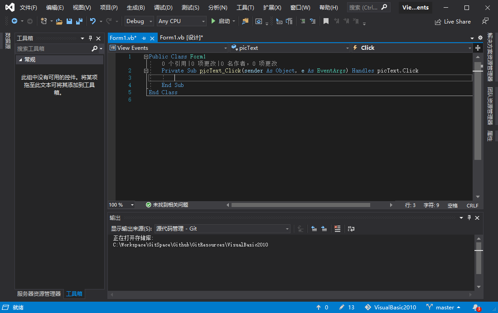
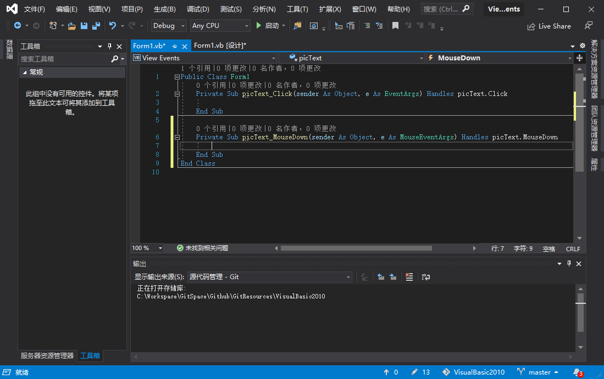

下面创建一个项目来体验如何使用事件。启动 Visual Basic 2010，创建一个新的 Windows 应用程序项目，将其命名为 View Events，然后执行以下步骤。

1. 在 "解决方案资源管理器" 中，右击 Form1.vb 并选择 "重命名"，再将文件名改为 ViewEventsForm.vb。然后，将该窗体的属性 Text改为 View Events Example。
2. 使用工具箱将一个图片框添加到窗体中。
3. 将图片框的名称改为 picText，然后双击图片框以访问其事件。

点击事件列表（右边的列表），看看图片框支持的所有事件，。从列表中选择 MouseDown，代码窗口将变成如下图所示：

MouseDown 事件方法的第一个参数 sender 存储一个通用对象。Object 参数可以是 Visual Basic 支持的任何对象类型。第二个参数 e 则表明真正的行为在何处发生。参数 e 也存储一个对象，但在这里，这个对象是 System.Windows.Forms.MouseEventArgs 类型。

| 属性     | 说明                                                         |
| -------- | ------------------------------------------------------------ |
| Clicks   | 返回单击鼠标按键的次数                                       |
| Button   | 返回单击的按键（左、中、右）                                 |
| Delta    | 返回一个整数或负数，指出向前或向后滚动鼠标滑轮的次数         |
| X        | 返回用户单击时光标所处位置的水平坐标                         |
| Y        | 返回用户单击时光标所处位置的垂直坐标                         |
| Location | 返回一个 Point 对象，其中包含用户单击时鼠标所处位置的 X 坐标和 Y 坐标 |

<b>System.Windows.Forms.MouseEventArgs 的常用成员</b>

