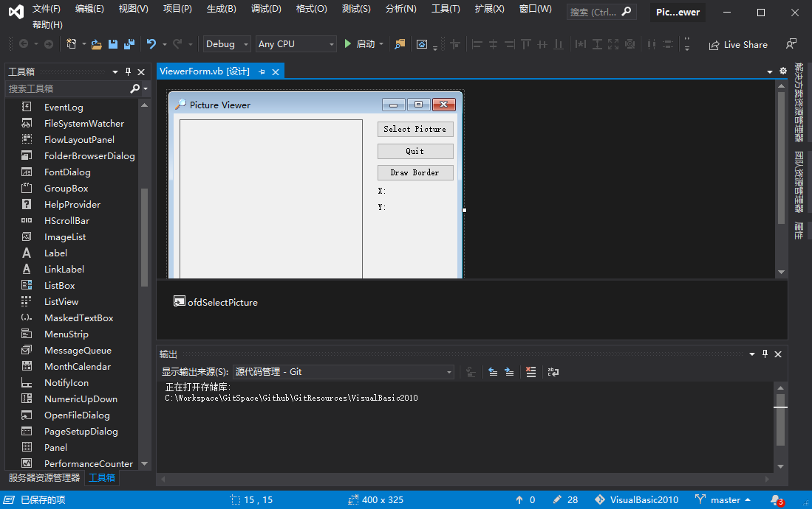
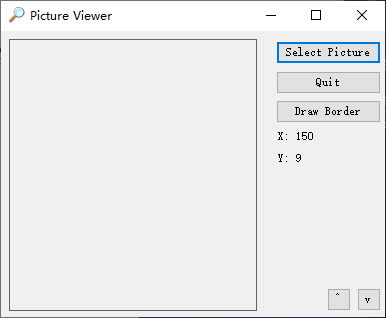
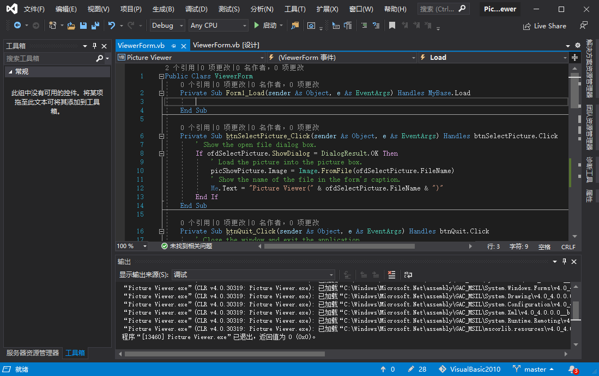

下面通过修改第3章的 Picture Viewer 项目来演示如何使用 MouseMove 事件。

**1. 创建用户界面**

需要添加两个标签控件到窗体中：一个用于显示 X 值，一个用于显示 Y 值。在工具箱中双击 Label 工具，将一个标签控件添加到窗体中，并按如下设置其属性。

| 属性     | 值     |
| -------- | ------ |
| Name     | lblX   |
| Location | 275,99 |
| Text     | X:     |

使用工具箱再添加一个标签控件到窗体中。按如下设置它的属性。

| 属性     | 值      |
| -------- | ------- |
| Name     | lblY    |
| Location | 275,121 |
| Text     | Y:      |



**2. 创建事件处理程序**

第一个要使用的事件是 MouseMove 事件。双击窗体上的图片框以访问其事件过程。双击控件时，总是为这类控件的默认事件创建事件过程，对于图片框来说，这是 Click 事件。打开事件列表，从列表中选择 MouseMove，Visual Basic 将为该图片框创建一个 MouseMove 过程。

注意到 Visual Basic 保留了为用户创建的默认事件过程。最好不要保留不用的代码，因此现在删除 Click 事件。

在 MouseMove 事件过程中输入下列代码：

```vb
lblX.Text = "X: " & e.X
lblY.Text = "Y: " & e.Y
```



MouseLeave 事件仅在鼠标离开控件时触发。执行下列步骤，在鼠标离开图片框时清除坐标。打开控件 picShowPicture 的事件列表，并选择 MouseLeave。在 MouseLeave 事件中输入以下代码：

```vb
lblX.Text = ""
lblY.Text = ""
```

在窗体加载是初始化它们的值，执行下列步骤可以实现这一点。

1. 从左上角的下拉列表中选择 "（ViewerForm 事件）"，这是到窗体的对象引用。

2. 打开右上角的事件列表并从中选择 Load。Load 事件在窗体加载时自动执行，非常适合用于初始化标签控件。

   

3. 输入下面两条代码语句：

```vb
lblX.Text = ""
lblY.Text = ""
```

