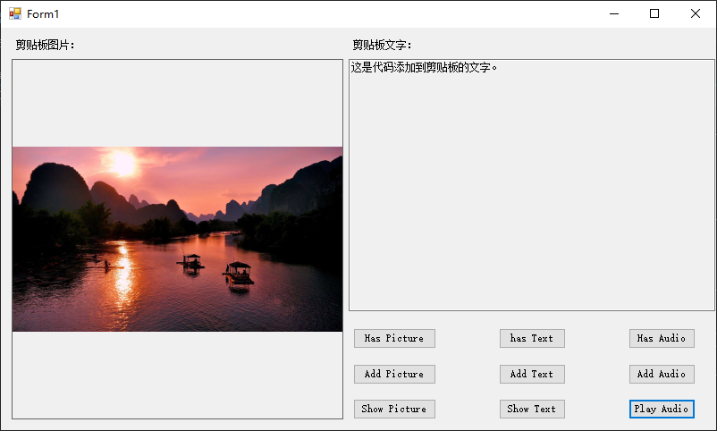

[toc]

### 从剪贴板读取数据

使用 [GetText](https://docs.microsoft.com/zh-cn/dotnet/api/microsoft.visualbasic.myservices.clipboardproxy.gettext?view=netframework-4.8) 方法读取剪贴板中的文本。下面的代码读取文本并将其显示在消息框中。剪贴板中必须存储文本该实例才能正常运行。

```vb
MsgBox(My.Computer.Clipboard.GetText())
```

使用 [GetImage](https://docs.microsoft.com/zh-cn/dotnet/api/microsoft.visualbasic.myservices.clipboardproxy.getimage?view=netframework-4.8) 方法从剪贴板检索图像。本示例先检查剪贴板中是否存在图像，然后再检索图像并将其分配给 `PictureBox1`。

```vb
If My.Computer.Clipboard.ContainsImage() Then
    Dim grabpicture As System.Drawing.Image
    grabpicture = My.Computer.Clipboard.GetImage()
    picturebox1.Image = grabpicture
End If
```

> 即使在关闭应用程序后，剪贴板中存储的项仍将保留。

### 确定存储在剪贴板中的文件类型

剪贴板中的数据可以采用多种形式，如文本、音频文件或图像。若要确定哪种文件位于剪贴板中，可以使用如 [ContainsAudio](https://docs.microsoft.com/zh-cn/dotnet/api/microsoft.visualbasic.myservices.clipboardproxy.containsaudio)、[ContainsFileDropList](https://docs.microsoft.com/zh-cn/dotnet/api/microsoft.visualbasic.myservices.clipboardproxy.containsfiledroplist)、[ContainsImage](https://docs.microsoft.com/zh-cn/dotnet/api/microsoft.visualbasic.myservices.clipboardproxy.containsimage) 和 [ContainsText](https://docs.microsoft.com/zh-cn/dotnet/api/microsoft.visualbasic.myservices.clipboardproxy.containstext)  的方法。如果有想要检查的自定义格式，可以使用  [ContainsData](https://docs.microsoft.com/zh-cn/dotnet/api/microsoft.visualbasic.myservices.clipboardproxy.containsdata) 方法。

使用 `ContainsImage` 函数可确定剪贴板中的数据是否为图像。下面的代码检查数据是否为图像并相应地进行报告。

```vb
If My.Computer.Clipboard.ContainsImage() Then
    MsgBox("Clipboard contains an image.")
Else
    MsgBox("Clipboard does not contain an image.")
End If
```

### 清除剪贴板

[Clear](https://docs.microsoft.com/zh-cn/dotnet/api/microsoft.visualbasic.myservices.clipboardproxy.clear) 方法可以清除剪贴板。 由于剪贴板被其他进程共享，清除它可能会影响这些进程。

下面的代码演示如何使用 `Clear` 方法。

```vb
My.Computer.Clipboard.Clear()
```

### 写入剪贴板

使用 [SetText](https://docs.microsoft.com/zh-cn/dotnet/api/microsoft.visualbasic.myservices.clipboardproxy.settext) 方法将文本写入剪贴板。 下面的代码将字符串“This is a test string”写入剪贴板。

```vb
My.Computer.Clipboard.SetText("This is a test string.")
```

`SetText` 方法可接受包含 [TextDataFormat](https://docs.microsoft.com/zh-cn/dotnet/api/system.windows.forms.textdataformat) 类型的格式参数。 下面的代码可将字符串“This is a test string”以 RTF 文本格式写入剪贴板。

```vb
My.Computer.Clipboard.SetText("This is a test string.", 
System.Windows.Forms.TextDataFormat.Rtf)
```

使用 [SetData](https://docs.microsoft.com/zh-cn/dotnet/api/microsoft.visualbasic.myservices.clipboardproxy.setdata) 方法将数据写入剪贴板。 此示例以自定义格式 `specialFormat` 向剪贴板写入 `DataObject` `dataChunk`。

```vb
My.Computer.Clipboard.SetData("specialFormat", dataChunk)
```

使用 [SetAudio](https://docs.microsoft.com/zh-cn/dotnet/api/microsoft.visualbasic.myservices.clipboardproxy.setaudio) 方法将音频数据写入剪贴板。 此示例将创建字节数组 `musicReader`，向其中读取文件 `cool.wav`，然后将其写入剪贴板。

```vb
Dim musicReader = My.Computer.FileSystem.ReadAllBytes("cool.wav")
My.Computer.Clipboard.SetAudio(musicReader)
```

> 警告：由于其他用户可访问剪贴板，不要将其用于存储密码或机密数据等敏感信息。

下面是测试应用界面：



相关代码如下所示：

```vb
Public Class Form1
    Private Sub btnHasPicture_Click(sender As Object, e As EventArgs) Handles btnHasPicture.Click
        If My.Computer.Clipboard.ContainsImage() Then
            MsgBox("Clipboard contains an image.")
        Else
            MsgBox("Clipboard does not contain an image.")
        End If
    End Sub

    Private Sub btnHasText_Click(sender As Object, e As EventArgs) Handles btnHasText.Click
        If My.Computer.Clipboard.ContainsText() Then
            MsgBox("Clipboard contains text.")
        Else
            MsgBox("Clipboard does not contain text.")
        End If
    End Sub

    Private Sub btnHasAudio_Click(sender As Object, e As EventArgs) Handles btnHasAudio.Click
        If My.Computer.Clipboard.ContainsAudio() Then
            MsgBox("Clipboard contains a audio.")
        Else
            MsgBox("Clipboard dose not contain a audio.")
        End If
    End Sub

    Private Sub btnPlayAudio_Click(sender As Object, e As EventArgs) Handles btnPlayAudio.Click, Button2.Click
        If My.Computer.Clipboard.ContainsAudio() Then
            My.Computer.Audio.Play(My.Computer.Clipboard.GetAudioStream, AudioPlayMode.Background)
        End If
    End Sub

    Private Sub btnShowPicture_Click(sender As Object, e As EventArgs) Handles btnShowPicture.Click
        If My.Computer.Clipboard.ContainsImage() Then
            pictureBox.Image = My.Computer.Clipboard.GetImage()
        End If
    End Sub

    Private Sub btnShowText_Click(sender As Object, e As EventArgs) Handles btnShowText.Click
        If My.Computer.Clipboard.ContainsText() Then
            textBox.Text = My.Computer.Clipboard.GetText()
        End If
    End Sub

    Private Sub btnAddAudio_Click(sender As Object, e As EventArgs) Handles btnAddAudio.Click
        Dim musicReader = My.Computer.FileSystem.ReadAllBytes("C:/Waterfall.wav")
        My.Computer.Clipboard.SetAudio(musicReader)
    End Sub

    Private Sub btnAddText_Click(sender As Object, e As EventArgs) Handles btnAddText.Click
        My.Computer.Clipboard.SetText("这是代码添加到剪贴板的文字。")
    End Sub

    Private Sub btnAddPicture_Click(sender As Object, e As EventArgs) Handles btnAddPicture.Click
        My.Computer.Clipboard.SetImage(Image.FromFile("C:/GuiLin.jpg"))
    End Sub
End Class

```

