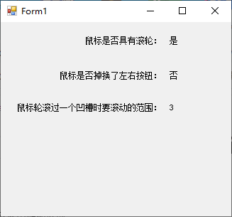

下表列出了与 `My.Computer.Mouse` 对象相关联的任务，并提供了演示如何完成每个任务的主题链接。

| 到                                     | 请参阅                                                       |
| :------------------------------------- | :----------------------------------------------------------- |
| 确定鼠标是否具有滚轮。                 | [WheelExists](https://docs.microsoft.com/zh-cn/dotnet/api/microsoft.visualbasic.devices.mouse.wheelexists#Microsoft_VisualBasic_Devices_Mouse_WheelExists) |
| 确定是否已掉换鼠标的左右按钮           | [ButtonsSwapped](https://docs.microsoft.com/zh-cn/dotnet/api/microsoft.visualbasic.devices.mouse.buttonsswapped#Microsoft_VisualBasic_Devices_Mouse_ButtonsSwapped) |
| 设置鼠标轮滚过一个凹槽时要滚动的范围。 | [WheelScrollLines](https://docs.microsoft.com/zh-cn/dotnet/api/microsoft.visualbasic.devices.mouse.wheelscrolllines#Microsoft_VisualBasic_Devices_Mouse_WheelScrollLines) |

下面是测试应用界面：



下面是测试应用的代码：

```vb
Public Class Form1
    Private Sub Form1_Load(sender As Object, e As EventArgs) Handles MyBase.Load
        If (My.Computer.Mouse.WheelExists) Then
            lbWheelExists.Text = "是"
        Else
            lbWheelExists.Text = "否"
        End If
        If (My.Computer.Mouse.ButtonsSwapped) Then
            lbButtonsSwapped.Text = "是"
        Else
            lbButtonsSwapped.Text = "否"
        End If
        lbWheelScrollLines.Text = My.Computer.Mouse.WheelScrollLines.ToString()
    End Sub
End Class
```

