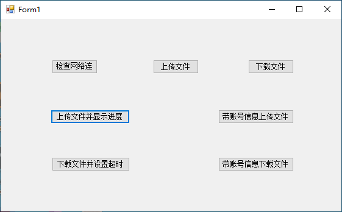

[toc]

以下是与 `My.Computer.Network` 对象相关的任务。

### 上传文件

可以使用 `UploadFile` 方法上传文件，同事将源文件的位置和目标目录位置指定为字符串或 URI （统一资源标识符）。此示例将文件 `Order.txt` 上传到 `http://www.cohowinery.com/uploads.aspx` 。

```vb
My.Computer.Network.UploadFile(
  "C:\My Documents\Order.txt",
  "http://www.cohowinery.com/upload.aspx")
```

### 上传文件并显示操作进度

可以使用 `UploadFile` 方法上传文件，同时将源文件的位置和目标目录位置指定为字符串或 URI。 此示例在不提供用户名或密码的情况下将文件 `Order.txt` 上传到 `http://www.cohowinery.com/uploads.aspx`显示了上传操作的进度，并将将超时间隔为 500 毫秒。

```vb
My.Computer.Network.UploadFile(
  "C:\My Documents\Order.txt",
  "http://www.cohowinery.com/upload.aspx", "", "", True, 500)
```

### 上传文件并提供用户名和密码

可以使用 `UploadFile` 方法上传文件，同时将源文件的位置和目标目录位置指定为字符串或 URI，并指定用户名和密码。 此示例将文件 `Order.txt` 上传到 `http://www.cohowinery.com/uploads.aspx`，并提供了用户名 `anonymous` 和空白密码。

```vb
My.Computer.Network.UploadFile(
  "C:\My Documents\Order.txt",
  "http://www.cohowinery.com/upload.aspx", "anonymous", "")
```

> 以下情况可能会发生异常：
>
> + 本地文件路径无效 ([ArgumentException](https://docs.microsoft.com/zh-cn/dotnet/api/system.argumentexception))。
> + 身份验证失败 ([SecurityException](https://docs.microsoft.com/zh-cn/dotnet/api/system.security.securityexception))。
> + 连接超时 ([TimeoutException](https://docs.microsoft.com/zh-cn/dotnet/api/system.timeoutexception))。

### 下载文件

[DownloadFile](https://docs.microsoft.com/zh-cn/dotnet/api/microsoft.visualbasic.devices.network.downloadfile) 方法可用来下载远程文件并将其存储到特定位置。 如果 `ShowUI` 参数设置为 `True`，则显示一个对话框，该对话框显示下载进度并允许用户取消该操作。 默认情况下，不会覆盖同名的现有文件；如果希望覆盖现有文件，则将 `overwrite` 参数设为 `True`。

以下情况可能会导致异常：

- 驱动器名称无效 ([ArgumentException](https://docs.microsoft.com/zh-cn/dotnet/api/system.argumentexception))。
- 尚未提供必要的身份验证（[UnauthorizedAccessException](https://docs.microsoft.com/zh-cn/dotnet/api/system.unauthorizedaccessexception) 或 [SecurityException](https://docs.microsoft.com/zh-cn/dotnet/api/system.security.securityexception)）。
- 服务器未在指定的 `connectionTimeout` ([TimeoutException](https://docs.microsoft.com/zh-cn/dotnet/api/system.timeoutexception)) 内响应。
- 请求被网站 ([WebException](https://docs.microsoft.com/zh-cn/dotnet/api/system.net.webexception)) 拒绝。

使用 `DownloadFile` 方法下载文件，同时将目标文件的位置指定为字符串或 URI 并指定要存储该文件的位置。 此示例从 `http://www.cohowinery.com/downloads` 下载 `WineList.txt` 文件，并将其保存到 `C:\Documents and Settings\All Users\Documents` 中：

```vb
My.Computer.Network.DownloadFile(
    "http://www.cohowinery.com/downloads/WineList.txt",
    "C:\Documents and Settings\All Users\Documents\WineList.txt")
```

### 下载文件，并指定超时间隔

使用 `DownloadFile` 方法下载文件，同时将目标文件的位置指定为字符串或 URI，指定要存储该文件的位置，并以毫秒为单位指定超时间隔（默认值为 1000 毫秒）。 此示例从 `http://www.cohowinery.com/downloads` 下载 `WineList.txt` 文件，然后将该文件保存到 `C:\Documents and Settings\All Users\Documents`，同时将超时间隔指定为 500 毫秒：

```vb
My.Computer.Network.DownloadFile(
    "http://www.cohowinery.com/downloads/WineList.txt",
    "C:\Documents and Settings\All Users\Documents\WineList.txt", False, 500)
```

### 提供用户名和密码下载文件

使用 `DownLoadFile` 方法下载文件，同时将目标文件的位置指定为字符串或 URI，并指定要存储该文件的位置、用户名和密码。 此示例使用用户名 `anonymous` 和空密码从 `http://www.cohowinery.com/downloads` 下载 `WineList.txt` 文件，然后将该文件保存到 `C:\Documents and Settings\All Users\Documents`。

```vb
My.Computer.Network.DownloadFile(
    "http://www.cohowinery.com/downloads/WineList.txt",
    "C:\Documents and Settings\All Users\Documents\WineList.txt", "anonymous", "")
```

> 重要：
>
> `DownLoadFile` 方法使用的 FTP 协议以纯文本方式发送信息（包括密码），因此不应用于传送敏感信息。

### 检查计算机是否具有有效的网络连接

[IsAvailable](https://docs.microsoft.com/zh-cn/dotnet/api/microsoft.visualbasic.devices.network.isavailable#Microsoft_VisualBasic_Devices_Network_IsAvailable) 属性可用于确定计算机是否具有有效的网络连接或 Internet 连接。

确定 `IsAvailable` 属性是 `True` 还是 `False`。 以下代码检查属性的状态并进行报告

```vb
If My.Computer.Network.IsAvailable Then
    MsgBox("Computer is connected.")
Else
    MsgBox("Computer is not connected.")
End If
```

下面是测试应用界面：



下面是测试应用的代码：

```vb
Public Class Form1
    Private Sub btnCheckNetwork_Click(sender As Object, e As EventArgs) Handles btnCheckNetwork.Click
        If My.Computer.Network.IsAvailable Then
            MsgBox("Computer is connected.")
        Else
            MsgBox("Computer is not connected.")
        End If
    End Sub

    Private Sub btnUpload_Click(sender As Object, e As EventArgs) Handles btnUpload.Click
        My.Computer.Network.UploadFile("C:\Waterfall.wav", "http://www.cohowinery.com/upload.aspx")
    End Sub

    Private Sub btnDownload_Click(sender As Object, e As EventArgs) Handles btnDownload.Click
        My.Computer.Network.DownloadFile("https://github.com/android/wear-os-samples/blob/main/README.md", "C:\Workspace\WineList.txt")
    End Sub

    Private Sub btnUploadShowProcess_Click(sender As Object, e As EventArgs) Handles btnUploadShowProcess.Click
        My.Computer.Network.UploadFile("C:\Waterfall.wav", "http://www.cohowinery.com/upload.aspx", "", "", True, 500)
    End Sub

    Private Sub btnUploadWithInfo_Click(sender As Object, e As EventArgs) Handles btnUploadWithInfo.Click
        My.Computer.Network.UploadFile("C:\Waterfall.wav", "http://www.cohowinery.com/upload.aspx", "anonymous", "")
    End Sub

    Private Sub btnDownloadWithInfo_Click(sender As Object, e As EventArgs) Handles btnDownloadWithInfo.Click
        My.Computer.Network.DownloadFile("https://github.com/android/wear-os-samples/blob/main/README.md", "C:\Workspace\WineList.txt", "anonymous", "")
    End Sub

    Private Sub btnDownloadWithTimeout_Click(sender As Object, e As EventArgs) Handles btnDownloadWithTimeout.Click
        My.Computer.Network.DownloadFile("https://github.com/android/wear-os-samples/blob/main/README.md", "C:\Workspace\WineList.txt", False, 500)
    End Sub
End Class

```

