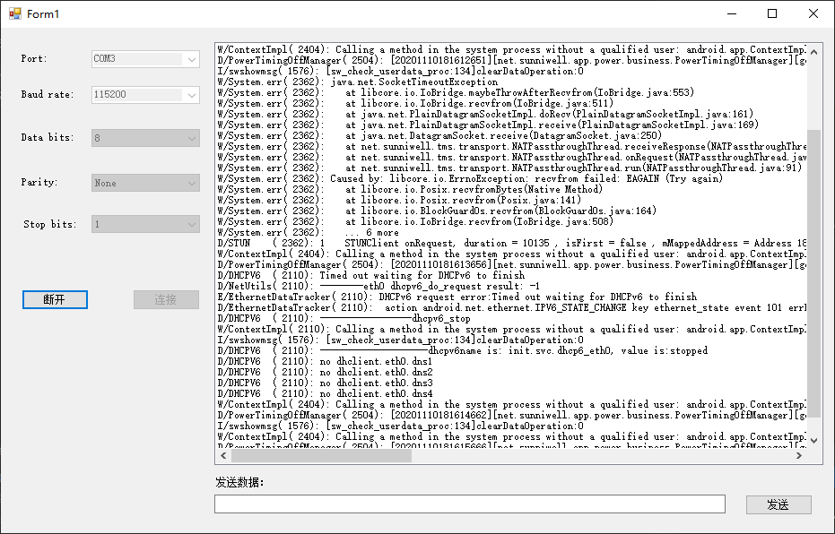

[toc]

`My.Computer.Ports` 对象提供用于访问计算机的串行端口的属性和方法。

### 显示可用的串行端口

此示例循环访问 `My.Computer.Ports.SerialPortNames` 属性返回的所有字符串。 这些字符串是计算机上的可用串行端口的名称。

通常，用户从可用端口列表中选择应用程序应使用的串行端口。 在此示例中，串行端口名称存储在 [ListBox](https://docs.microsoft.com/zh-cn/dotnet/api/system.windows.forms.listbox) 控件中。 有关详细信息，请参阅 [ListBox 控件](https://docs.microsoft.com/zh-cn/dotnet/desktop/winforms/controls/listbox-control-windows-forms)。

```vb
Sub GetSerialPortNames()
    ' Show all available COM ports.
    For Each sp As String In My.Computer.Ports.SerialPortNames
        ListBox1.Items.Add(sp)
    Next
End Sub
```

### 编译代码

此示例需要：

- 对 System.Windows.Forms.dll 的项目引用。
- 对 [System.Windows.Forms](https://docs.microsoft.com/zh-cn/dotnet/api/system.windows.forms) 命名空间成员的访问权限。 如果未在代码中完全限定成员名称，则添加 `Imports` 语句。 有关详细信息，请参阅 [Imports 语句（.NET 命名空间和类型）](https://docs.microsoft.com/zh-cn/dotnet/visual-basic/language-reference/statements/imports-statement-net-namespace-and-type)。
- 窗体具有名为 `ListBox1` 的 [ListBox](https://docs.microsoft.com/zh-cn/dotnet/api/system.windows.forms.listbox) 控件。

> 备注：
>
> 在 Windows 98 上运行时，`My.Computer.Ports.SerialPortNames` 返回的端口名称可能不正确。 若要防止应用程序错误，请在使用端口名称打开端口时使用异常处理（如 `Try...Catch...Finally` 语句或 `Using` 语句）。

### 使用连接到串行端口的调制解调器拨号

1. 确定调制解调器连接到的串行端口。 此示例假定调制解调器在 COM1 上。

2. 使用 `My.Computer.Ports.OpenSerialPort` 方法获取对端口的引用。 有关详细信息，请参阅 [OpenSerialPort](https://docs.microsoft.com/zh-cn/dotnet/api/microsoft.visualbasic.devices.ports.openserialport)。

   `Using` 块允许应用程序在即使会生成异常的情况下也关闭串行端口。 操作串行端口的所有代码都应出现在此块中，或者出现在 `Try...Catch...Finally` 块中。

   ```vb
   Using com1 As IO.Ports.SerialPort =
           My.Computer.Ports.OpenSerialPort("COM1", 9600)
   End Using
   ```

3. 设置 `DtrEnable` 属性，指示计算机已准备好接受从调制解调器传入的传输。

```vb
com1.DtrEnable = True
```

4. 通过 [Write](https://docs.microsoft.com/zh-cn/dotnet/api/system.io.ports.serialport.write) 方法将拨号命令和电话号码从串行端口发送到调制解调器。

```vb
com1.Write("ATDT 555-0100" & vbCrLf)
```

**示例**

```vb
Sub DialModem()
    ' Dial a number via an attached modem on COM1.
    Using com1 As IO.Ports.SerialPort =
            My.Computer.Ports.OpenSerialPort("COM1", 9600)
        com1.DtrEnable = True
        com1.Write("ATDT 555-0100" & vbCrLf)
        ' Insert code to transfer data to and from the modem.
    End Using
End Sub
```

> 该示例需要引用 [System](https://docs.microsoft.com/zh-cn/dotnet/api/system) 命名空间。

### 将字符串发送到串行端口

本示例将字符串发送到 COM1 串行端口。 你可能需要使用计算机上的其他串行端口。

使用 `My.Computer.Ports.OpenSerialPort` 方法获取对端口的引用。 有关详细信息，请参阅 [OpenSerialPort](https://docs.microsoft.com/zh-cn/dotnet/api/microsoft.visualbasic.devices.ports.openserialport)。

`Using` 块允许应用程序在即使会生成异常的情况下也关闭串行端口。 操作串行端口的所有代码都应出现在此块中，或者出现在 `Try...Catch...Finally` 块中。

[WriteLine](https://docs.microsoft.com/zh-cn/dotnet/api/system.io.ports.serialport.writeline) 方法将数据发送到串行端口。

```vb
Sub SendSerialData(ByVal data As String)
    ' Send strings to a serial port.
    Using com1 As IO.Ports.SerialPort =
            My.Computer.Ports.OpenSerialPort("COM1")
        com1.WriteLine(data)
    End Using
End Sub
```

### 从串行端口接收字符串

1. 初始化返回字符串。

   ```vb
   Dim returnStr As String = ""
   ```

2. 确定应提供字符串的串行端口。 此示例假定它是 `COM1`。

3. 使用 `My.Computer.Ports.OpenSerialPort` 方法获取对端口的引用。 有关详细信息，请参阅 [OpenSerialPort](https://docs.microsoft.com/zh-cn/dotnet/api/microsoft.visualbasic.devices.ports.openserialport)。

   Try...Catch...Finally` 块允许应用程序在即使会生成异常的情况下也关闭串行端口。 操作串行端口的所有代码都应出现在此块中。

   ```vb
   Dim com1 As IO.Ports.SerialPort = Nothing
   Try
       com1 = My.Computer.Ports.OpenSerialPort("COM1")
       com1.ReadTimeout = 10000
   
   Catch ex As TimeoutException
       returnStr = "Error: Serial Port read timed out."
   Finally
       If com1 IsNot Nothing Then com1.Close()
   End Try
   ```

4. 创建 `Do` 循环，用于读取文本行，直到没有更多行可用

   ```vb
   Do
   Loop
   ```

5. 使用 [ReadLine()](https://docs.microsoft.com/zh-cn/dotnet/api/system.io.ports.serialport.readline#System_IO_Ports_SerialPort_ReadLine) 方法来从串行端口读取下一个可用的文本行。

   ```vb
   Dim Incoming As String = com1.ReadLine()
   ```

6. 使用 `If` 语句可确定 [ReadLine()](https://docs.microsoft.com/zh-cn/dotnet/api/system.io.ports.serialport.readline#System_IO_Ports_SerialPort_ReadLine) 方法是否返回 `Nothing`（这意味着没有更多文本可用）。 如果它未返回 `Nothing`，则退出 `Do` 循环。

   ```vb
   If Incoming Is Nothing Then
       Exit Do
   End If
   ```

7. 向 `If` 语句添加 `Else` 块以处理实际读取字符串的情况。 该块将来自串行端口的字符串追加到返回字符串。

   ```vb
   Else
       returnStr &= Incoming & vbCrLf
   ```

8. 返回字符串。

   ```vb
   Return returnStr
   ```

**示例**

```vb
Function ReceiveSerialData() As String
    ' Receive strings from a serial port.
    Dim returnStr As String = ""

    Dim com1 As IO.Ports.SerialPort = Nothing
    Try
        com1 = My.Computer.Ports.OpenSerialPort("COM1")
        com1.ReadTimeout = 10000
        Do
            Dim Incoming As String = com1.ReadLine()
            If Incoming Is Nothing Then
                Exit Do
            Else
                returnStr &= Incoming & vbCrLf
            End If
        Loop
    Catch ex As TimeoutException
        returnStr = "Error: Serial Port read timed out."
    Finally
        If com1 IsNot Nothing Then com1.Close()
    End Try

    Return returnStr
End Function
```

### 在 .NET Framework 中执行的端口操作

可以通过 [System.IO.Ports](https://docs.microsoft.com/zh-cn/dotnet/api/system.io.ports) 命名空间中的 .NET Framework 类访问计算机的串行端口。 最重要的类 [SerialPort](https://docs.microsoft.com/zh-cn/dotnet/api/system.io.ports.serialport) 为同步和事件驱动 I/O 提供框架，提供对插针和中断状态的访问，以及对串行驱动程序属性的访问。 它可以包装在可通过 [BaseStream](https://docs.microsoft.com/zh-cn/dotnet/api/system.io.ports.serialport.basestream#System_IO_Ports_SerialPort_BaseStream) 属性访问的 [Stream](https://docs.microsoft.com/zh-cn/dotnet/api/system.io.stream) 对象中。 将 [SerialPort](https://docs.microsoft.com/zh-cn/dotnet/api/system.io.ports.serialport) 包装在 [Stream](https://docs.microsoft.com/zh-cn/dotnet/api/system.io.stream) 对象中，以便允许使用流的类访问串行端口。 该命名空间包含可以简化对串行端口的控制的枚举。

创建 [SerialPort](https://docs.microsoft.com/zh-cn/dotnet/api/system.io.ports.serialport) 对象的最简单的方法是通过 [OpenSerialPort](https://docs.microsoft.com/zh-cn/dotnet/api/microsoft.visualbasic.devices.ports.openserialport) 方法。

> 备注：
>
> 不能使用 .NET Framework 类直接访问并行端口、USB 端口等其他类型的端口。

此表列出并描述了用于访问串行端口的主要枚举：

| 枚举                                                         | 说明                                                         |
| :----------------------------------------------------------- | :----------------------------------------------------------- |
| [Handshake](https://docs.microsoft.com/zh-cn/dotnet/api/system.io.ports.handshake) | 指定在为 [SerialPort](https://docs.microsoft.com/zh-cn/dotnet/api/system.io.ports.serialport) 对象建立串行端口通信时使用的控制协议。 |
| [Parity](https://docs.microsoft.com/zh-cn/dotnet/api/system.io.ports.parity) | 指定 [SerialPort](https://docs.microsoft.com/zh-cn/dotnet/api/system.io.ports.serialport) 对象的奇偶校验位。 |
| [SerialData](https://docs.microsoft.com/zh-cn/dotnet/api/system.io.ports.serialdata) | 指定在 [SerialPort](https://docs.microsoft.com/zh-cn/dotnet/api/system.io.ports.serialport) 对象的串行端口上收到的字符的类型。 |
| [SerialError](https://docs.microsoft.com/zh-cn/dotnet/api/system.io.ports.serialerror) | 指定在 [SerialPort](https://docs.microsoft.com/zh-cn/dotnet/api/system.io.ports.serialport) 对象上发生的错误 |
| [SerialPinChange](https://docs.microsoft.com/zh-cn/dotnet/api/system.io.ports.serialpinchange) | 指定在 [SerialPort](https://docs.microsoft.com/zh-cn/dotnet/api/system.io.ports.serialport) 对象上发生的更改的类型。 |
| [StopBits](https://docs.microsoft.com/zh-cn/dotnet/api/system.io.ports.stopbits) | 指定在 [SerialPort](https://docs.microsoft.com/zh-cn/dotnet/api/system.io.ports.serialport) 对象上使用的停止位的数目。 |

下面是测试应用界面：



下面是测试应用的代码：

```vb
Public Class Form1

    Private serialPort As IO.Ports.SerialPort
    Private stopRead As Boolean
    Private context As SynchronizationContext
    Private Sub Form1_Load(sender As Object, e As EventArgs) Handles MyBase.Load
        cbPort.Items.Add("-- Not Select --")
        ' Show all available COM ports.
        For Each sp As String In My.Computer.Ports.SerialPortNames
            cbPort.Items.Add(sp)
        Next
        cbPort.SelectedIndex = 0
        If cbPort.Items.Count > 1 Then
            cbPort.SelectedIndex = 1
        End If
        cbBaudRate.Items.AddRange(New String() {"110", "300", "600", "1200", "2400",
                                  "4800", "9600", "14400", "19200", "38400", "57600",
                                  "115200", "230400", "380400", "460800", "921600"})
        cbBaudRate.SelectedIndex = 11
        cbDataBits.Items.AddRange(New String() {"5", "6", "7", "8"})
        cbDataBits.SelectedIndex = 3
        cbDataBits.DropDownStyle = ComboBoxStyle.DropDownList
        cbParity.Items.AddRange(New String() {"None", "Odd", "Even", "Mark", "Space"})
        cbParity.SelectedIndex = 0
        cbParity.DropDownStyle = ComboBoxStyle.DropDownList
        cbStopBits.Items.AddRange(New String() {"None", "1", "1.5", "2"})
        cbStopBits.SelectedIndex = 1
        cbStopBits.DropDownStyle = ComboBoxStyle.DropDownList
        btnClose.Enabled = False
        btnSend.Enabled = False
        tbSendData.Enabled = False
        lbReceiver.SelectionMode = SelectionMode.None
        serialPort = Nothing
        stopRead = False
        context = SynchronizationContext.Current
    End Sub

    Private Sub updateControlsStatu(isConnected As Boolean)
        cbPort.Enabled = Not isConnected
        cbBaudRate.Enabled = Not isConnected
        cbDataBits.Enabled = Not isConnected
        cbParity.Enabled = Not isConnected
        cbStopBits.Enabled = Not isConnected
        btnClose.Enabled = isConnected
        btnConnect.Enabled = Not isConnected
        tbSendData.Enabled = isConnected
        btnSend.Enabled = isConnected
    End Sub

    Private Async Sub btnConnect_ClickAsync(sender As Object, e As EventArgs) Handles btnConnect.Click
        Dim port As String = cbPort.SelectedItem.ToString()
        Dim baudRate As Integer = Integer.Parse(cbBaudRate.SelectedItem.ToString())
        Dim dataBits As Integer = Integer.Parse(cbDataBits.SelectedItem.ToString())
        Dim parity As System.IO.Ports.Parity = System.IO.Ports.Parity.None
        Select Case cbParity.SelectedItem.ToString()
            Case "None"
                parity = IO.Ports.Parity.None
            Case "Odd"
                parity = IO.Ports.Parity.Odd
            Case "Even"
                parity = IO.Ports.Parity.Even
            Case "Mark"
                parity = IO.Ports.Parity.Mark
            Case "Space"
                parity = IO.Ports.Parity.Space
        End Select
        Dim stopBits As IO.Ports.StopBits = IO.Ports.StopBits.None
        Select Case cbStopBits.SelectedItem.ToString()
            Case "None"
                stopBits = IO.Ports.StopBits.None
            Case "1"
                stopBits = IO.Ports.StopBits.One
            Case "1.5"
                stopBits = IO.Ports.StopBits.OnePointFive
            Case "2"
                stopBits = IO.Ports.StopBits.Two
        End Select
        Try
            serialPort = My.Computer.Ports.OpenSerialPort(port, baudRate, parity, dataBits, stopBits)
            lbReceiver.Items.Clear()
            updateControlsStatu(True)
            stopRead = False
            ShowThreadInfo("App")
            'Dim bytes As Byte() = System.Text.Encoding.UTF8.GetBytes("logcat\n")
            'serialPort.Write(bytes, 0, bytes.Length)
            'serialPort.WriteLine("logcat\n")
            Dim t As Thread = New Thread(AddressOf readData)
            t.Start()
        Catch ex As Exception
            serialPort = Nothing
            updateControlsStatu(False)
        End Try
    End Sub

    Private Sub btnClose_Click(sender As Object, e As EventArgs) Handles btnClose.Click
        stopRead = True
        If serialPort IsNot Nothing Then
            serialPort.Close()
        End If
        updateControlsStatu(False)
    End Sub

    Private Sub readData()
        ShowThreadInfo("readData")
        serialPort.ReadTimeout = 100
        Do
            If stopRead Then
                Exit Do
            Else
                Try
                    Dim Incomming As String = serialPort.ReadLine()
                    If Incomming IsNot Nothing Then
                        Console.WriteLine(Incomming)
                        context.Post(New SendOrPostCallback(Function(s As String) {addItem(s)}), Incomming)
                    End If
                Catch te As TimeoutException
                Catch ex As Exception
                    Console.WriteLine("Error: " & ex.StackTrace)
                End Try
            End If
        Loop
        Console.WriteLine("read data end.")
    End Sub

    Private Sub stopReadSerialData()
        stopRead = True
    End Sub

    Private Function addItem(s As String)
        lbReceiver.Items.Add(s)
        lbReceiver.TopIndex = lbReceiver.Items.Count - (lbReceiver.Height / lbReceiver.ItemHeight)
    End Function

    Private Function ShowThreadInfo(s As String)
        Console.WriteLine("{0} Thread ID: {1}",
                        s, Thread.CurrentThread.ManagedThreadId)
    End Function

    Private Sub btnSend_Click(sender As Object, e As EventArgs) Handles btnSend.Click
        Dim data As String = tbSendData.Text
        serialPort.WriteTimeout = 1000
        If data.Trim IsNot "" Then
            'Dim bytes As Byte() = System.Text.Encoding.UTF8.GetBytes(data & "\n")
            'serialPort.Write(bytes, 0, bytes.Length)
            serialPort.WriteLine(data)
        End If
    End Sub
End Class
```

