[toc]

### 1. 按照正常操作创建 Visual Basic 窗体应用

1. 依次单击 "文件" -> "新建" -> "项目"。

   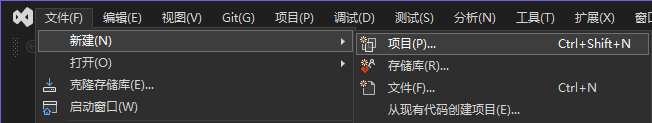

2. 在弹出的对话框中，选择左边的 "Windows 窗体应用" 项，在右边选择 "Visual Basic" 语言，"Windows" 平台，然后在下面列表中选择 "Windows 窗体应用"，最后单击 "下一步" 按钮。

   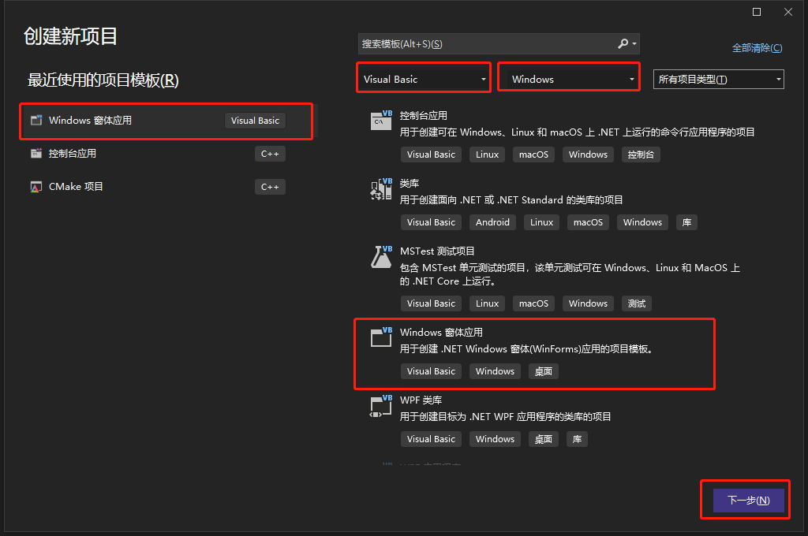

3. 在弹出的对话框中的 ""项目名称输入框" "中输入项目名称，在 "位置" 输入框中选择项目保存位置，然后单击 "下一步" 按钮。

   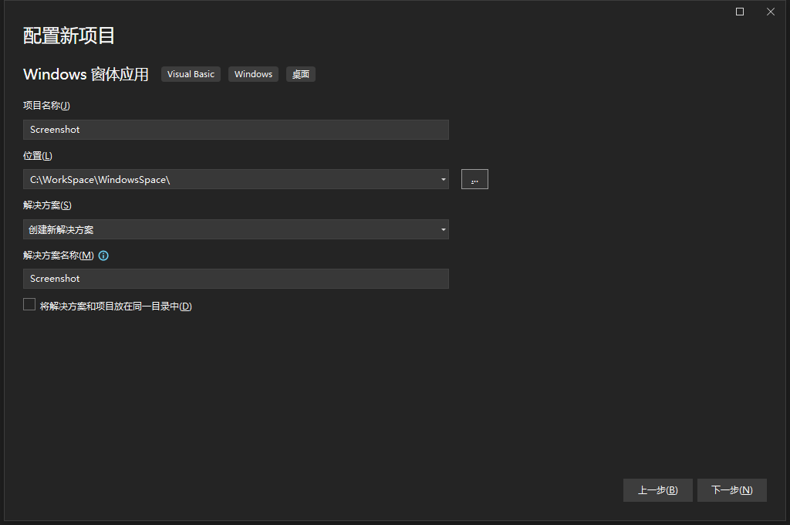

4. 在 "其他信息" 对话框中选择 `.NET` 框架，然后单击 "创建" 按钮。

   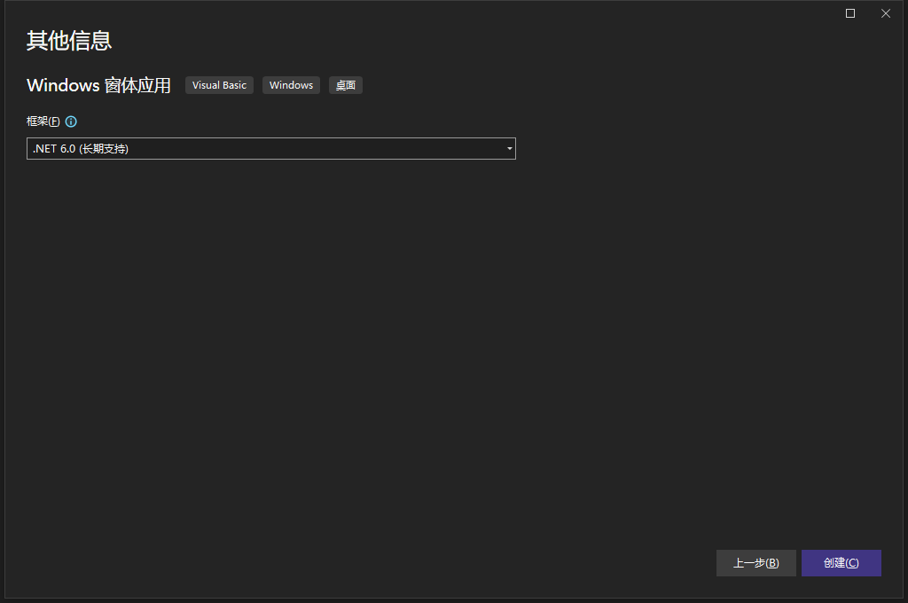

### 2. 创建任务栏使用的菜单

1. 在 "工具箱" -> "菜单和工具栏" 下的列表中双击 `ContextMenuStrip`，添加该控件到窗口中。

   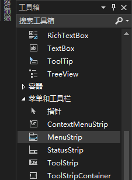

2. 在窗体设计窗口底部选中 `ContextMenuStrip` 控件，然后在窗体中添加任务栏需要的菜单项。

   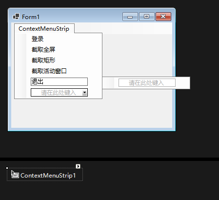

### 3. 创建任务栏控件

1. 在 "工具箱" -> "公共控件"  下的列表中双击 `NotifyIcon` 控件，添加一个 `NotifyIcon` 控件。

   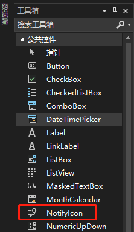

2. 在窗体设计窗口下方选中 "NotifyIcon" 控件，在属性对话框中 "外观" 分组中设置 "Icon" 任务栏图标。

   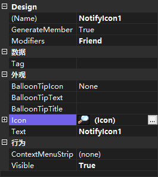

3. 在 "属性" 窗口中的 "行为" 分组中设置 `ContextMenuStrip` 属性为第二步创建的菜单对象。

   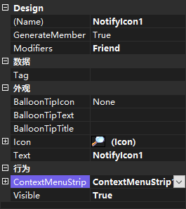

### 4. 启动时隐藏窗体

在 "窗体设计窗口" 中双击窗体，在窗体的 `Shown` 事件中添加隐藏窗体代码：

```vb
Private Sub Form1_Shown(sender As Object, e As EventArgs) Handles Me.Shown
    Me.Hide()
End Sub
```

### 5. 设置窗体样式

1. 在 "窗体设计窗口" 中选中窗体，然后在 "属性" 窗口的 "窗口样式" 分组中修改 `ShowInTaskbar` 属性值为 `False`，禁止在任务栏中显示应用图标：

   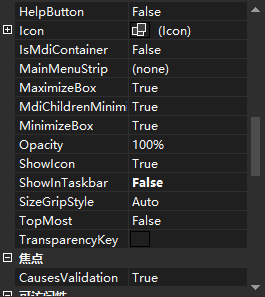

2. 修改 "属性" 窗口的 "外观" 分组中的 `FormBorderStyle` 属性值为 `None`，设置窗体边框为无：

   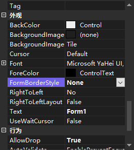

### 6. 运行效果如下

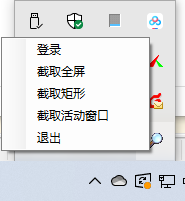