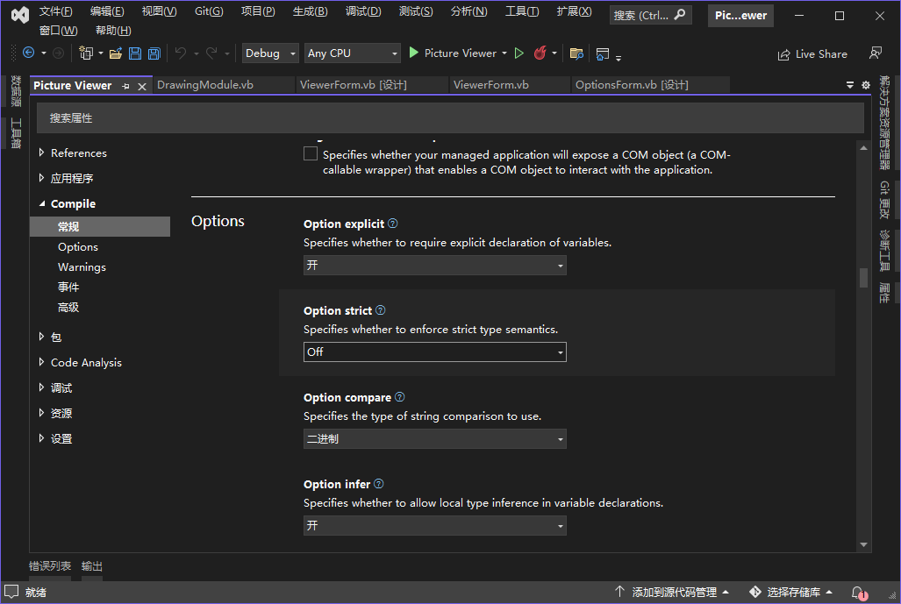

默认情况下，Visual Basic 要求用户使用变量前进行声明，这被称为显式变量声明。另外，还可以要求 Visual Basic 执行严格的数据类型检查。严格类型检查意味着在不会丢失数据或精度的情况下，Visual Basic 将自动执行扩大转换，但对于其他转换，用户必须显式地将数据从一种类型转换为另一种类型。

要在项目中启动严格检查（Option Strict），可执行如下步骤：

1. 右击 "解决方案资源管理器" 中的项目名并从上下文菜单中选择 "属性"。
2. 在 "项目属性" 页中，单击左边的选项卡 "编译"。
3. 从下拉列表 `Option Strict` 中选择 `On`。

​	   

4. 将 `Option Infer` 改为 `Off`。

> 提示：如果保留 `Option Infer` 设置为 `On`，代码会继续执行，而不会出现错误。`Option Infer` 让 Visual Basic 根据赋给变量的值来猜测变量的数据类型。建议将该选项设置为 `Off`，否则将抵消 `Option Explicit` 的效果。