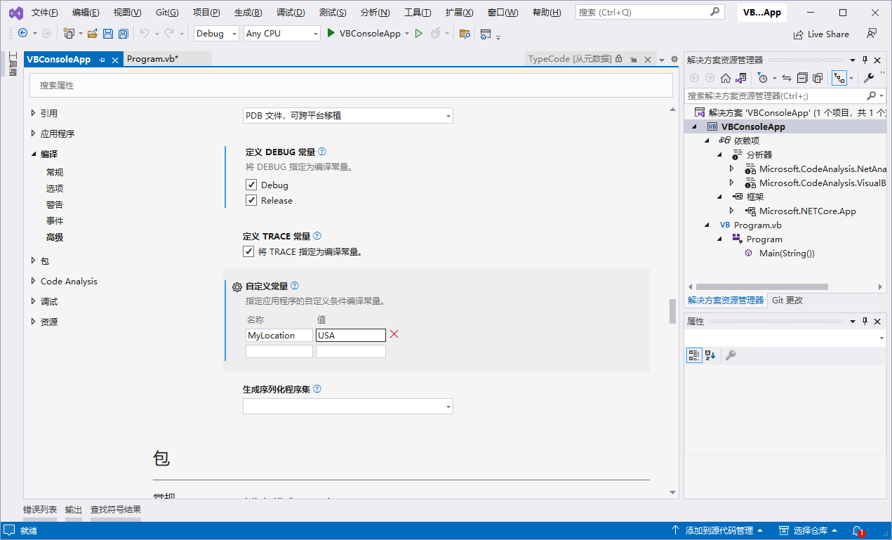

[toc]

`#Const` 指令为 Visual Basic 定义条件编译常量。

> 提示：也可以在工程配置中添加 `#Const` 指令：
>
> 1. 在 `解决方案` 窗口中右击 `项目名称`，在弹出的菜单中选择 `属性`.
>
> 2. 在属性窗口中依次点击 `编译` -> `高级`，在 `高级` 窗口中找到 `自定义常量`，在名称输入框中输入要定义的常量名称，在值输入框中输入常量的值即可。
>
>    

### 语法

```vb
#Const constname = expression
```

### 组成部分

+ `constname`：必需。 正在定义的常量的名称。

+ `expression`：必需。 字面量、其他条件编译器常量，或包含任何或所有算术或逻辑运算符的任何组合，但 `Is` 除外。

### 注解

条件编译器常量对于它们出现的文件始终是私有的。 你不能使用 `#Const` 指令创建公共编译器常量；你只能在用户界面中或使用 `/define` 编译器选项创建它们。

你只能在 `expression` 中使用条件编译器常量和文字。 使用通过 `Const` 定义的标准常量会导致错误。 相反，你可以将通过 `#Const` 关键字定义的常量仅用于条件编译。 常量也可以是未定义的，在这种情况下它们的值为 `Nothing`。

### 示例

此示例使用 `#Const` 指令。

```vb
#Const MyLocation = "USA"

Module Program
    Sub Main(args As String())
#If MyLocation = "USA" Then
        Console.WriteLine($"MyLocation is USA")
#Else
        Console.WriteLine("MyLocation is not USA")
#End If
    End Sub

End Module
```