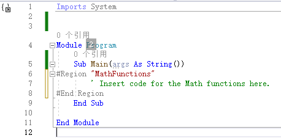
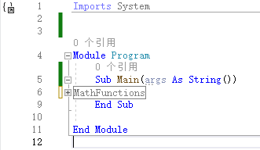

[toc]

`#Region` 指令用于折叠并隐藏 `Visual Basic` 文件中的代码段。

### 语法

```vb
#Region string_literal
' 0 or more statements
#End Region
```

### 组成部分

| 术语             | 定义                                                         |
| :--------------- | :----------------------------------------------------------- |
| `#Region`        | 必需。 指定区域的开始。                                      |
| `string_literal` | 必需。 当区域处于折叠状态时充当区域标题的字符串（用双引号括起来）。 默认情况下，区域处于折叠状态。 |
| `#End Region`    | 必需。 终止 `#Region` 块。                                   |

### 注解

使用 `#Region` 指令指定使用 Visual Studio Code IDE 的大纲显示功能时要展开或折叠的代码块。 你可以将区域放置（或“嵌套”）到其他区域中，以将类似区域组合在一起。

### 示例

```vb
#Region "MathFunctions"
    ' Insert code for the Math functions here.
#End Region
```

显示效果如下：



<center><b>展开状态</b></center>



<center><b>折叠状态</b></center>