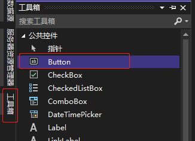

[toc]

### 1. 通过工具箱添加

1. 点击左边栏中的 "工具箱" 按钮。如果没有看到 "工具箱" 按钮，可以通过 "视图" -> "工具箱" 或 <kbd>Ctrl</kbd> + <kbd>Alt</kbd> + <kbd>X</kbd> 快捷键来显示工具箱。
2. 在 "工具箱" 窗口的 "公共控件" 列表中拖动 "Button" 按钮到窗体中即可。或者选择 "Button" 按钮后，在窗体需要放置按钮的地方单击即可添加按钮。

### 2. 通过复制已有的控件添加

右击已存在的 "Button" 控件，并从弹出的菜单中选择 "复制" 命令。接下来，在窗体的任意处右击并从窗体的快捷菜单中选择 "粘贴"（也可使用键盘 <kbd>Ctrl</kbd> + <kbd>C</kbd> 组合键进行复制，用 <kbd>Ctrl</kbd> + <kbd>V</kbd> 组合键进行粘贴）命令。新按钮出现在窗体中央，且默认被选中。

> 注意
>
> 通过复制添加的控件与原控件属性几乎相同，但名称已重新设置。
