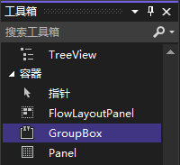

`GroupBox` 是一个容器控件，有可用于创建边框——称为框架——和标题的属性。创建 `GroupBox` 控件时，它默认有边框，标题被设置为控件的名称。

在 `工具箱` -> `容器` 列表里双击 `GroupBox` 控件（或长按 `GroupBox` 控件将其拖动到窗口设计界面中）。

分组框除用来定义边框和显示标题外，分组的用处是为其他控件提供容器。

> 注意：在很大程度上说，`Panel` 控件时 `GroupBox` 控件的精简版。如果只需要简单的容器控件而不需要 `GroupBox` 控件提供的额外特性（如边框和标题），就使用 `Panel` 控件。一种例外是，吗，面板和窗体一样也提供滚动功能，而分组框不支持。