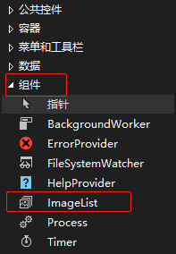
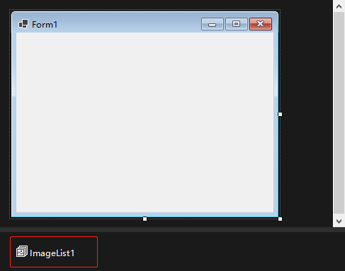

很多控件都能够将图片与不同类型的元素关联起来。`Microsoft` 本可以让每个控件在内部存储图像，但这样效率很低，因为这样不允许控件共享图片——每个需要图像的控件都必须自己存储图像，这也可能导致维护问题。`Microsoft` 创建了一个控件专门用于存储图片，并为其他控件提供图片，这就是 `ImageList`。

在 "工具箱" -> "组件" 中双击 `ImageList` 控件（或长按控件将其拖动到设计窗口中）将 `ImageList` 添加到设计窗口中。`ImageList` 控件是运行时不可见的控件，因此显示在窗体的下方。

