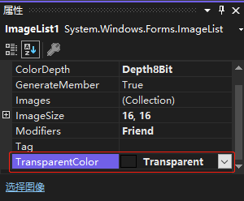

`ImageList` 控件有一个 `TransparentColor` 属性。默认情况下，`TransparentColor` 属性设置为 `Transparent`。如果图标文件包含透明度信息，这里不必设置 `TransparentColor` 属性；如果使用的是 `BMP` 文件或不包含透明度信息的其他格式，则需要使用该属性来指定一种颜色，在位图被其他控件使用时，该颜色将变成透明的。

