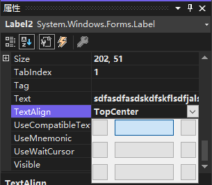

`TextBox` 控件的 `TextAlign` 属性指定控件内文本的对齐方式。对齐方式有 `TopLeft`（顶部左对齐）、`TopCenter`（顶部居中对齐）、 `TopRight`（顶部右对齐）、 `MiddleLeft`（中间左对齐）、`MiddleCenter`（中间居中对齐）、 `MiddleRight`（中间右对齐）、 `BottomLeft`（底部左对齐）、`BottomCenter`（底部居中对齐）、 `BottomRight`（底部右对齐）。

