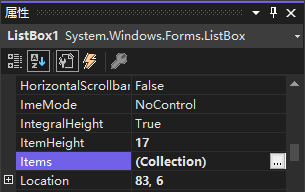
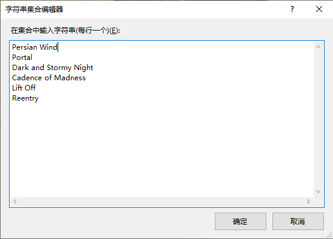

列表框包含的每项都是列表框的 `Items` 集合的成员。对列表项的操作包括添加或删除项目，这是通过 `Items` 集合实现的。

`Items` 集合是列表框的一个属性。在 "属性" 窗口中找到 `Items` 属性，并单击选中它，将出现熟悉的带三点的按钮，表示可以对该属性进行高级设置。单击该按钮打开 "字符串集合编辑器"。要在集合中添加项，只需在文本框中输入——每项占一行。

> 提示：列表可以包含重复的值。