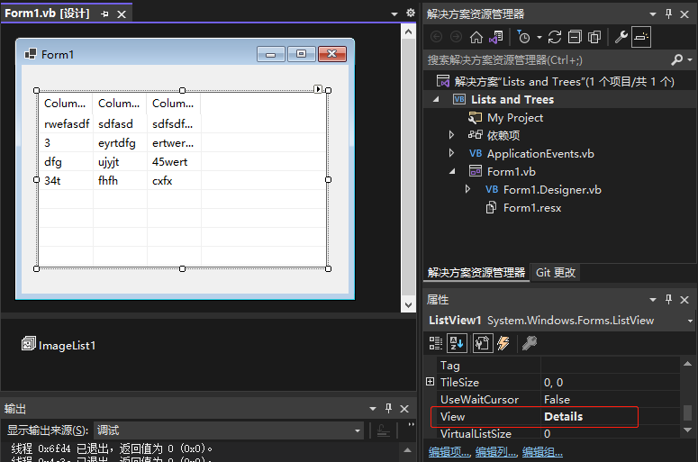
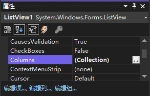
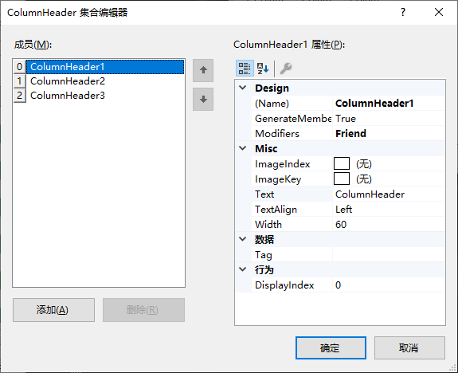

将 `ListView` 的 `View` 属性设置为 `Details` 时，控件将显示列标题。

列表标题的内容由 `Columns` 集合中定义的列决定。

1. 在 `属性` 窗口中选择 `Columns` 属性，然后单击出现的小按钮。`Visual Basic` 将打开 `ColumnHeader 集合编辑器` 窗口。

   

2. 通过单击 `添加` 按钮创建新列，并将其 `Text` 属性改为需要的列名。可以通过 `Width` 属性来改变列的宽度。

   