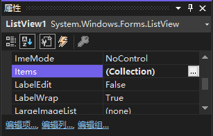
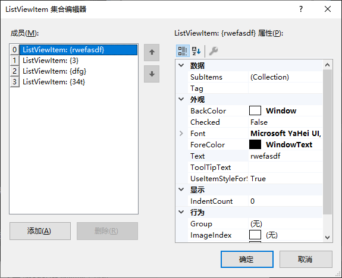
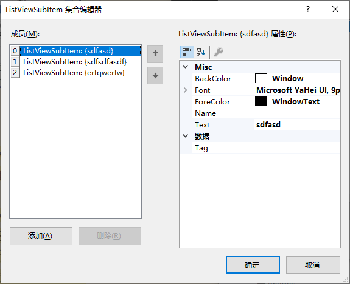

通过执行下列步骤添加列表项：

1. 在 `属性` 窗口中选择 `Items` 属性，然后单击出现的小按钮，这将打开 `ListViewItem 集合编辑器` 对话框。

   

2. 通过单击 `添加` 按钮创建新项，并将其 `Text` 属性改为需要的值。

    

   > 注意：这里的 `Text` 的值将作为列表第一列的值，之后的列值由 `SubItems` 集合决定。

3. 可以通过 `ImageIndex` 属性的下拉列表选择关联 `ImageList` 控件的图片。

   > 提示：`ImageList` 控件请参阅 《[ImageList 的使用.md](../ImageList 图像列表控件/ImageList 的使用.md)》。

4. 单击 `SubItems` 属性（它位于 `ListViewItem` 的 "数据" 分类下），然后单击出现的小按钮，这将打开 `ListViewSubItem 集合编辑器`。

   

5. 单击 `添加` 按钮创建新的子元素，并将其 `Text` 改为需要的值。