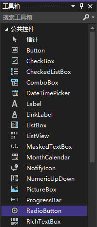

每个容器内只能同时有一个单选按钮被选中。选择一个单选按钮将自动取消对容器中其他按钮的选择。单选按钮用于提供给用户一组选择项，且只允许用户选择其中的一项。

将控件添加到分组框中有以下几种方法：

+ 直接在分组框中绘制控件；
+ 将控件放在分组框中；
+ 将控件添加到窗体中，然后剪切该控件，在选择分组框，最后将控件粘贴到分组框中。

在 `工具箱` -> `公共控件` 列表中长按 `RadioButton` 控件将其拖动到窗口设计界面的指定容器中。

> 注意：要确保单选按钮在它所属的容器内，否则它将被移到其他容器或窗体中。

> 注意：`RadioButton` 的 `Location` 属性总是以容器对象为参照。如果控件在窗体上，它的位置将相对于窗体左上角；如果控件在分组框中，其位置将相对于组件框左上角。

> 提示：互斥只发生在位于同一容器内的单选按钮之间。