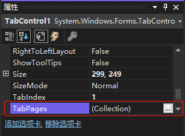
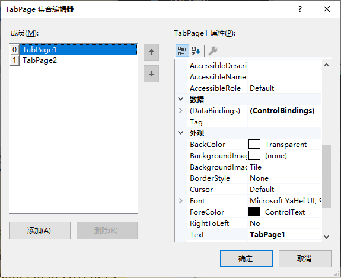

`TabControl` 控件上的选项卡由控件的 `TabPages` 集合决定。在 "属性" 窗口中单击 `Tab` 控件的 `TabPages` 属性，然后单击出现的小按钮就可以打开 "TabPage 集合编辑器"。

`Visual Basic` 将每个新页面命名为 `TabPageX`，其中 X 是唯一的数字。虽然从技术上说，可以不必修改页面的名称，但为页面取一个有意义的名称会比较方便。默认选中的是 `TabPage1`，它的属性显示在右边。

可以通过 `添加` 按钮添加选项卡或者 `删除` 按钮删除已有的选项卡，但是默认选项卡（编号为 0）的选项开无法删除。

可以通过 `name` 属性给选项卡命名，通过 `text` 属性修改选项卡显示的名称。