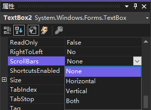
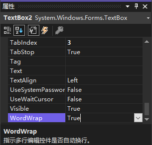

虽然可以调整文本框的大小，但有时控件的内容仍比显示区域大。如果添加到窗体中的文本框可能出现这种情况，可将 `ScrollBars` 属性从 `None` 值改为 `Vertical`、`Horizontal` 或 `Both`，从而给文本框添加滚动条。

**注意：**要让文本框显示滚动条，其 `Multiline` 属性必须为 `True`。另外，如果将 `ScrollBars` 属性设置为 `Both`，水平滚动条仅在 `WordWrap` 属性设置为 `False` 时才能显示。如果将 `WordWrap` 属性设置为 `True`，文本总是自动换行以适应控件的大小，因此不存在文本框右侧的文本不能显示的问题，也就不需要水平滚动条。

