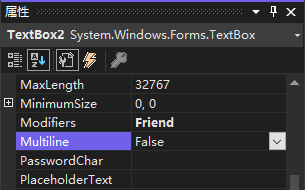

我们注意到上图中的文本框仅在左右两边有白色的大小调整手柄，这意味着只能调整控件的左右两边。这是因为该控件被定义为单行文本框，即只能显示一行文本。

要使文本框可以显示多行文本，将其 `Multiline` 属性设置为 `True`。

虽然可通过 "属性" 窗口设置文本框的 `Multiline` 属性，但还有一种更快捷的方式；选择文本框，再单击文本框上包含箭头的方框，这将打开一个快捷菜单，其中显示了属性 `Multiline`。单击该属性旁边的复选框以选中它，然后单击该菜单外部以关闭该菜单。大多数控件都有这样的快捷菜单，但其中的内容随选定的控件而异。

