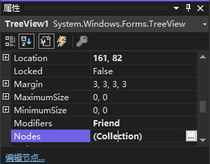
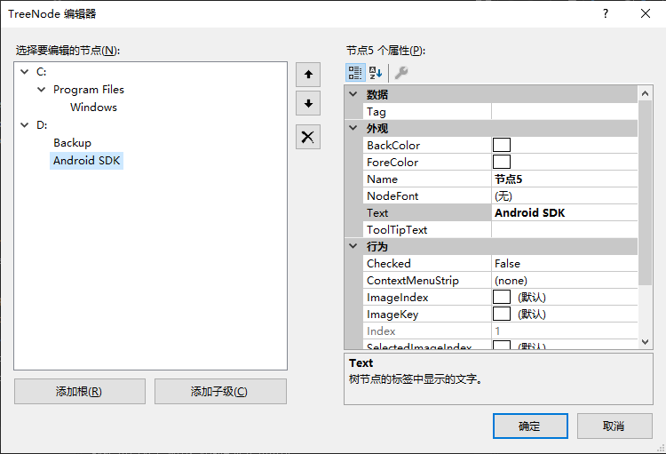

[toc]

### 1. 通过属性窗口添加节点

1. 在 `属性` 窗口中选择 `Nodes` 属性，然后单击出现的小按钮。`Visual Basic` 将打开 `TreeNode 编辑器` 窗口。

   

2. 通过单击 `添加根` 按钮创建根节点，并将其 `Text` 属性改为需要的根名。选择根节点，然后点击 `添加子级` 按钮，可以在根节点下创建一个子节点。

   

### 2. 通过代码添加节点

任何节点都可以是其他节点的父节点或某个节点的子节点（节点的父节点可通过其 `Parent` 属性来引用）。

可以通过如下代码为 `TreeView` 控件添加根节点：

```vb
Dim objNode As TreeNode
objNode = tvwLanguages.Nodes.Add("James")
objNode.Nodes.Add("Visual Basic")
```

### 3. 删除节点

要删除节点，调用 `Nodes` 集合的 `Remove()` 方法。`Remove()` 方法接受一个有效的节点作为参数，因此必须知道要删除哪个节点。例如，`TreeView` 控件的 `SelectedNode` 属性返回当前选中的节点，同样，要删除当前选中的节点，可用下面这条语句：

```vb
If Not (tvwLanguages.SelectedNode Is Nothing) Then
	tvwLanguages.Nodes.Remove(tvwLanguages.SelectedNode)
End If
```

> 警告：删除父节点的同时将删除其所有子节点。

### 4. 清除所有节点

要清除 `TreeView` 中的所有节点，调用 `Nodes` 集合的 `Clear()` 方法，如下所示：

```vb
tvwLanguages.Nodes.Clear()
```

