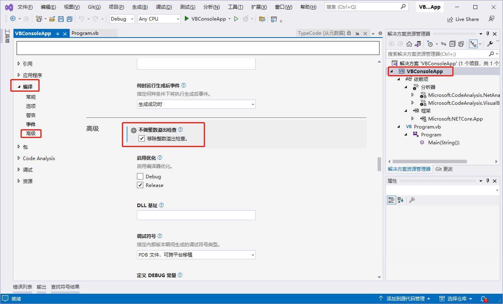

[toc]

`SByte` 数据类型保存 8 位（1 字节）带符号整数，值的范围为 -128 到 127。

### 注解

使用 `SByte` 数据类型可包含不需要 `Integer` 的完整数据宽度甚至 `Short` 的半数据宽度的整数值。 在某些情况下，公共语言运行时可以将 `SByte` 变量紧密地打包在一起，并节省内存消耗。

`SByte` 的默认值为 0。

### 文本赋值

可以通过为其分配十进制文本、十六进制文本、八进制文本或（从 Visual Basic 2017 开始）二进制文本来声明和初始化 `SByte` 变量。

在以下示例中，表示为十进制、十六进制和二进制文本且等于 -102 的整数被分配给 `SByte` 值。 此示例要求你使用 `/removeintchecks` 编译器开关进行编译（不做整数溢出检查）。

```vb
Dim sbyteValue1 As SByte = -102
Console.WriteLine(sbyteValue1)

Dim sbyteValue4 As SByte = &H9A
Console.WriteLine(sbyteValue4)

Dim sbyteValue5 As SByte = &B1001_1010
Console.WriteLine(sbyteValue5)
' The example displays the following output:
'          -102
'          -102
'          -102
```

> 修改移除整数溢出检查
>
> 在工程名称处右键，在弹出的菜单中选择 "属性"。属性界面选择 "编译 -> 高级" 处找到 `不做整数溢出检查` 项，勾选下面的 `移除整数溢出检查` 选框。
>
> 

> 备注
>
> 使用前缀 `&h` 或 `&H` 表示十六进制文本，使用前缀 `&b` 或 `&B` 表示二进制文本，使用前缀 `&o` 或 `&O` 表示八进制文本。 十进制文本没有前缀。

从 Visual Basic 2017 开始，还可以使用下划线字符 `_` 作为数字分隔符，以增强可读性，如下例所示。

```vb
Dim sbyteValue3 As SByte = &B1001_1010
Console.WriteLine(sbyteValue3)
' The example displays the following output:
'          -102
```

从 Visual Basic 15.5 开始，还可以使用下划线字符 (`_`) 作为前缀与十六进制、二进制或八进制数字之间的前导分隔符。 例如：

```vb
Dim number As SByte = &H_F9
```

若要使用下划线字符作为前导分隔符，必须将以下元素添加到 Visual Basic 项目 (*.vbproj) 文件中：

```xml
<PropertyGroup>
  <LangVersion>15.5</LangVersion>
</PropertyGroup>
```

如果整数文本在 `SByte` 范围之外（即，如果它小于 [SByte.MinValue](https://learn.microsoft.com/zh-cn/dotnet/api/system.sbyte.minvalue) 或大于 [SByte.MaxValue](https://learn.microsoft.com/zh-cn/dotnet/api/system.sbyte.maxvalue)），会发生编译错误。 当整数文字没有后缀时，则会推断为 [Integer](https://learn.microsoft.com/zh-cn/dotnet/visual-basic/language-reference/data-types/integer-data-type)。 如果整数文字超出 `Integer` 类型范围，则推断为 [Long](https://learn.microsoft.com/zh-cn/dotnet/visual-basic/language-reference/data-types/long-data-type)。 这意味着，在前面的示例中，数字文本 `0x9A` 和 `0b10011010` 被解释为值为 156 的 32 位带符号整数，该值超过了 [SByte.MaxValue](https://learn.microsoft.com/zh-cn/dotnet/api/system.sbyte.maxvalue)。 要成功编译像这样将非十进制整数分配给 `SByte` 的代码，你可以执行以下任一操作：

- 通过使用 `/removeintchecks` 编译器开关进行编译来禁用整数边界检查。

- 使用[类型字符](https://learn.microsoft.com/zh-cn/dotnet/visual-basic/programming-guide/language-features/data-types/type-characters)显式定义要分配给 `SByte` 的文字值。 以下示例将负文字 `Short` 值分配给 `SByte`。 请注意，对于负数，必须设置数字文字的高位字的高位。 在我们的示例中，这是字面 `Short` 值的第 15 位。

  ```vb
  Dim sByteValue1 As SByte = &HFF_9As
  Dim sByteValue2 As SByte = &B1111_1111_1001_1010s
  Console.WriteLine(sByteValue1)
  Console.WriteLine(sByteValue2)
  ```

### 编程提示

- **符合 CLS。** `SByte` 数据类型不是[公共语言规范](https://www.ecma-international.org/publications-and-standards/standards/ecma-335/) (CLS) 的一部分，因此符合 CLS 的代码不能使用使用它的组件。
- **Widening。** `SByte` 数据类型加宽到 `Short`、`Integer`、`Long`、`Decimal`、`Single` 和 `Double`。 这意味着，可以将 `SByte` 转换为这些类型中的任意类型，而不会遇到 [System.OverflowException](https://learn.microsoft.com/zh-cn/dotnet/api/system.overflowexception) 错误。
- **类型字符。** `SByte` 没有文本类型字符或标识符类型字符。
- **Framework 类型。** .NET Framework 中的对应类型是 [System.SByte](https://learn.microsoft.com/zh-cn/dotnet/api/system.sbyte) 结构。

