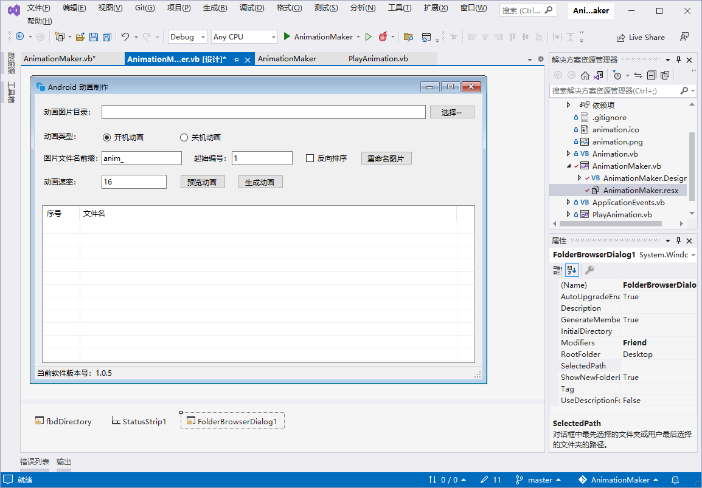

1. 打开【窗体设计界面】。

2. 在 【工具箱】中的 【对话框】项下，将 `FolderBrowserDialog` 控件拖入窗体中，最后该控件会显示在窗体的下方。

   

3. 通过在按钮的点击事件中调用该控件选择目录。

   ```vb
   Private Sub btnSelect_Click(sender As Object, e As EventArgs) Handles btnSelect.Click
       If fbdDirectory.ShowDialog() <> Windows.Forms.DialogResult.Cancel Then
           Debug.WriteLine("Select path: " + fbdDirectory.SelectedPath)
           If fbdDirectory.SelectedPath <> Animation.Directory Then
               Animation.Directory = fbdDirectory.SelectedPath
               tbDirectory.Text = Animation.Directory
               update_Pictures()
               update_ListView()
           End If
       End If
   End Sub
   ```

   