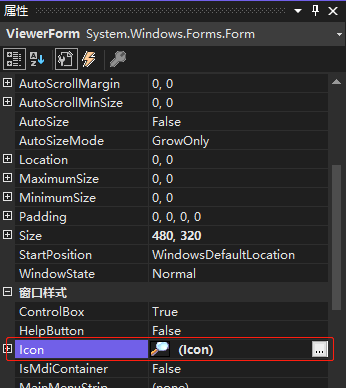

要为窗体指定图标，执行以下步骤：

1. 在 "属性" 窗口中，单击 Icon 属性以选中它。
2. 单击 Icon 属性后，该属性右边将出现一个带三个点的小按钮，单击该按钮。
3. 使用弹出的 "打开" 对话框找到 icon 图标文件。找到图标后双击它，或单击选中它再单击 "打开" 按钮。



> 提示：以前，推荐给每个窗体一个独特的图标，以表示窗体的用途。这一点在包含了上百个窗体的大型应用程序中很难做到。相反，通常最好将所有窗体的 `Icon` 属性设置为最能代表应用程序的图标。要将图标指定给窗体，按下列步骤进行：
>
> 1. 在窗体设计器中双击窗体，以访问其默认事件：`Load` 事件。
>
> 2. 在 `Load` 事件中输入下面的语句：
>
>    ```vb
>    Me.Icon = New Icon("C:\Users\Admin\Desktop\screenshot.ico")
>    ```
>

