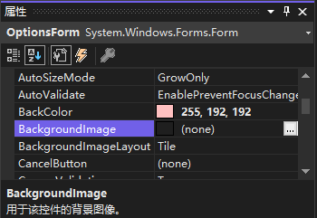
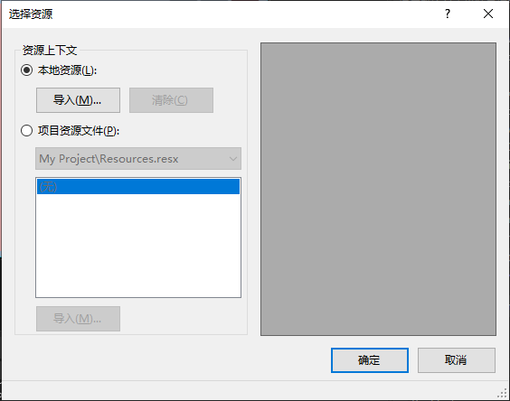
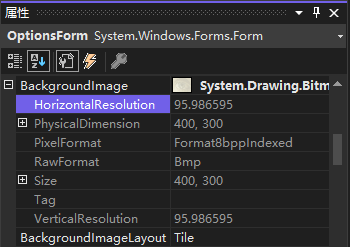

[toc]

### 1. 添加图片背景

要将图片添加到窗体中，可设置窗体的 `BackGroundImage` 属性。

执行下列步骤将图片添加到窗体中：

1. 单击窗体选中它。

2. 将窗体的 `Size` 属性改为 `400,300`。

3. 单击 "属性" 窗口中的 `BackGroundImage` 属性。

4. 单击出现在属性旁的 "生成" 按钮 。

5. 这时将打开对话框 "选择资源"。单击单选按钮 "本地资源"。

   

6. 单击 "导入"，然后找到文件 `Options.bmp`。
7. 返回 "选择资源" 对话框。单击 "确定" 加载图片。这时，选择的图片将显示在窗体的背景中。

在 "属性" 窗口中，`BackGroundImage` 属性的左边是一个包含加号的小框。这表示该属性还有相关属性（子属性）。

### 2. 删除背景图片

要将添加到窗体中的图片删除，右击 `BackgroundImage` 属性名，然后在弹出的菜单中选择 "重置"。