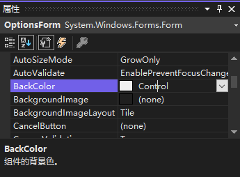
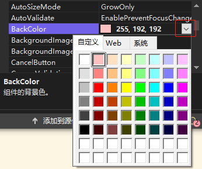
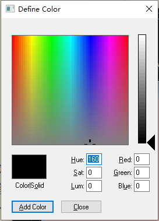

[toc]

### 1. 设置背景颜色

要修改窗体的背景色，可以修改 `BackColor` 属性。`BackColor` 属性是一个独特的属性，可用颜色名或 RGB 值来指定。



默认情况下，`BackColor` 属性设置为名为 `Control` 的颜色。该颜色是系统颜色，可能不是灰色。

在 "属性" 窗口中删除属性 `BackColor` 的值 `Control`，再输入 `0,0,255`，然后按回车键或 `Tab` 键来提交输入。提交输入后， `RGB` 值将变成 `Blue`。

要查看可用来为 `BackColor` 属性选择颜色的调色板，可单机 "属性" 窗口中 `BackColor` 属性的下拉箭头。



在自定义颜色框内右击鼠标即可弹出调色板：



在代码中可以通过如下代码进行设置：

```vb
Me.BackColor = Color.SteelBlue
```

### 2. 设置背景图片

可以通过窗体的 `BackgroundImage` 属性将图片设置为窗体的背景：

```vb
Me.BackgroundImage = Image.FromFile("C:\Users\Admin\Desktop\test.jpg")
```

同时可以通过窗体的 `BackgroundImageLayout` 属性设置背景图片的显示方式：

```vb
Me.BackgroundImageLayout = ImageLayout.Stretch
```

