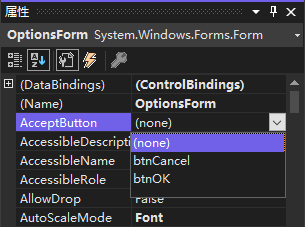
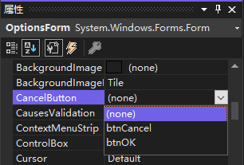

创建对话框时，通常将一个按钮指定为默认按钮（称为接受按钮）。如果窗体有接受按钮，用户按回车键将触发该按钮的 `Click` 事件，而不管那个控件获得焦点。

1. 在 "解决方案资源管理器" 中双击窗体文件，如 `OptionsForm.vb`，在设计器中显示该窗口。

2. 单击该窗体，以便在 "属性" 窗口中显示其属性。

3. 在 "属性" 窗口中，单击窗体的 `AcceptButton` 属性，将出现一个下拉箭头。单击该箭头并从列表中选择对应的按钮作为窗体的接受按钮。注意到窗体上的这个按钮现在有蓝色边框，表示它为窗体的默认按钮。

   

4. 如果窗体有 "取消" 按钮，将窗体的 `CancelButton` 属性设置为该按钮。

   

> 提示：一般地说，为窗体创建接受按钮时，应该同时创建取消按钮。取消按钮在用户按 <kbd>Esc</kbd> 键时其 `Click` 事件被触发，而不管焦点在那个控件上。