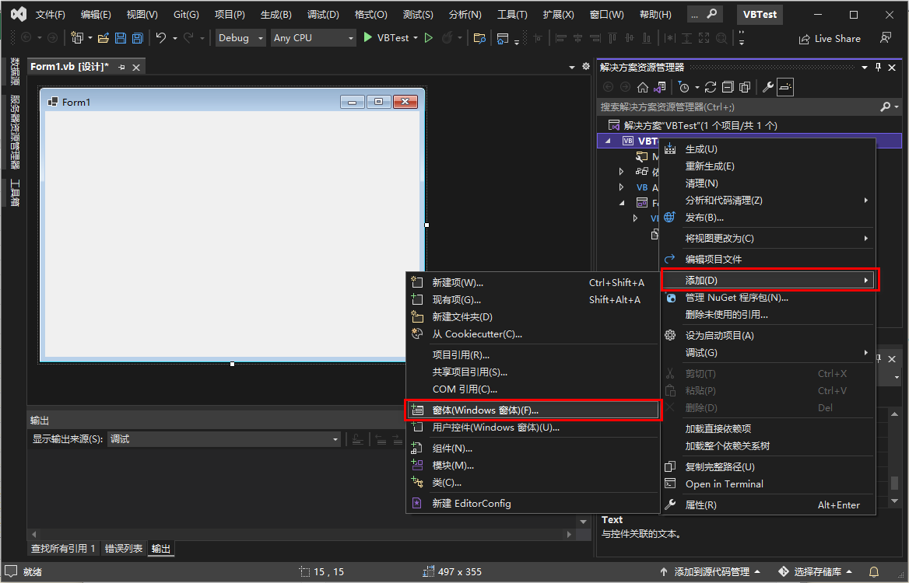
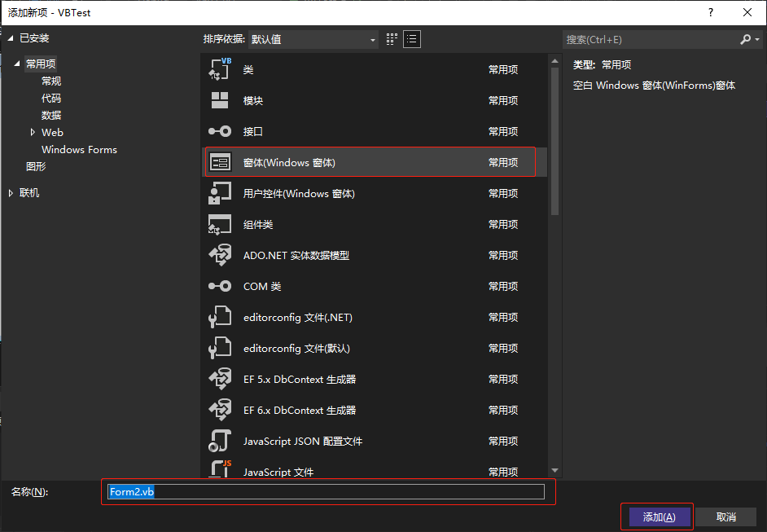
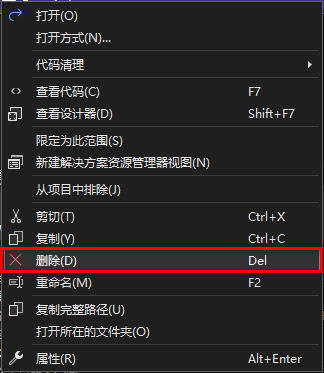

[toc]

### 1. 添加窗体

（1）在项目名称上右击，在弹出的菜单中选择 `添加(D)` -> ` 窗体(Windows 窗体)(F)...`。

（2）在弹出的 `添加新项` 对话框中选择 `窗体(Windows 窗体)`，在 `名称(N)` 输入框中输入窗体名称，最后单击 `添加` 按钮。

### 2. 添加现存窗体

（1）在项目名称上右击，在弹出的菜单中选择 `添加(D)` -> ` 现有项(G)...`。

（2）在弹出的 `添加现有项` 对话框中选择现存的窗体，然后点击 `添加` 按钮即可。

### 3. 移除窗体

只需在要删除的窗体名称上右击，在弹出的快捷菜单中选择 `删除` 命令，即可将窗体删除。

> 注意：当项目只有一个窗体时， `删除` 命令不可用。
