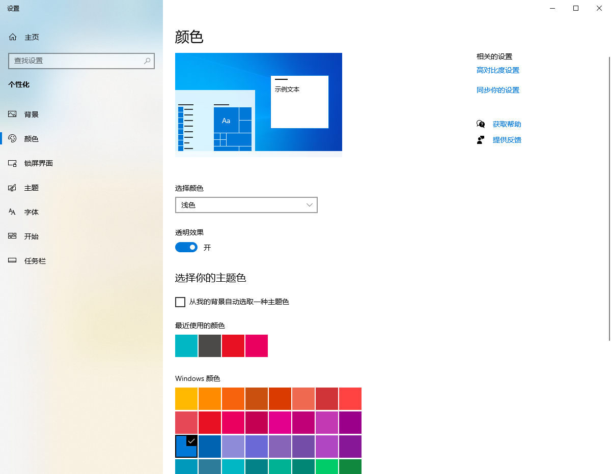

Windows 允许修改的颜色称为系统颜色。要修改系统颜色，右击桌面，从弹出菜单中选择 "个性化" 打开 "设置" 界面，在设置界面中选择 "颜色"，在右边 "选择你的主题色" 下选择要使用的颜色。

要指定界面颜色使其与用户系统颜色一致，可以将颜色属性设置为一种系统颜色。

<b>系统颜色</b>

| 枚举              | 说明                                           |
| ----------------- | ---------------------------------------------- |
| ActiveCaption     | 活动标题栏的背景色                             |
| ActiveCaptionText | 活动标题栏的文本颜色                           |
| Control           | 按钮和其他 3D 元素的背景色                     |
| ControlDark       | 3D 元素的阴影颜色                              |
| ControlLight      | 3D 元素的高光颜色                              |
| ControlText       | 按钮和其他 3D 元素的文本颜色                   |
| Desktop           | Windows 桌面的颜色                             |
| GrayText          | 用户界面元素不可用（处于暗淡状态）时的文本颜色 |
| Highlight         | 加亮文本的背景色。这包括选中的菜单项和文本     |
| HightlightText    | 加亮文本的前景色。这包括选中的菜单项和文本     |
| InactiveBorder    | 不活动窗体的边框颜色                           |
| InactiveCaption   | 不活动标题栏的文本颜色                         |
| Menu              | 菜单的背景色                                   |
| MenuText          | 菜单的文本颜色                                 |
| Window            | 窗体客户区域的背景色                           |

需要注意的是，如果使用系统颜色进行绘制，当用户修改系统颜色时 Visual Basic 不会自动更新颜色；你必须使用新的系统颜色重新绘制元素。另外，如果通常不使用系统颜色的属性使用了系统颜色，可能显示奇怪的颜色组合，如前景色和背景色都是黑色，这取决于用户的颜色设置。