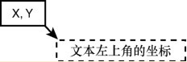

要在 `Graphics` 对象上绘制文本，调用 `DrawString()` 方法。`DrawString()` 的基本格式如下所示：

```vb
object.DrawString(stringoftext, font, brush, topX, leftY)
```

stringoftext 参数是要在 `Graphics` 对象上绘制的文本，topX 和 leftY 参数表示绘制位置的坐标；它们表示字符串左上角的位置：



参数 brush 和 font 分别表示笔刷和画笔。画笔描述的是线条样式，而笔刷描述的是填充样式。

绘制文本时，实心笔刷通常足够。可以像创建画笔一样创建笔刷，也可以通过 `System.Drawing.Brushes` 类获得标准笔刷。

`Font`（字体）对象定义了文本的格式特征，包括字符集（Times New Roman, Courier 等）、大小（点数）和样式（粗体、斜体、正常和下划线等）。要创建一个新 `Font` 对象，可用如下所示的代码：

```vb
Dim objFont As Font
objFont = New System.Drawing.Font("Arial", 30)
```

如果提供的字体名称在计算机上不存在，Visual Basic 将使用与指定字体最接近的默认字体。第二个参数是文本的大小。如果要使用非正常样式，可以将样式值作为第三个参数，如下所示：

```vb
objFont = New System.Drawing.Font("Arial Black", 30, FontStyle.Bold or FontStyle.Italic)
```

除创建 `Font` 对象外，也可以使用已有对象的字体：

```vb
objGraphics.DrawString("This is the text that prints!", Me.Font, System.Drawing.Brushes.Azure, 0, 0)
```

