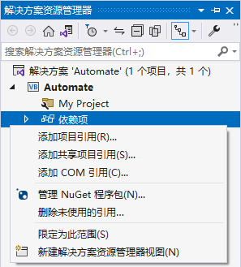
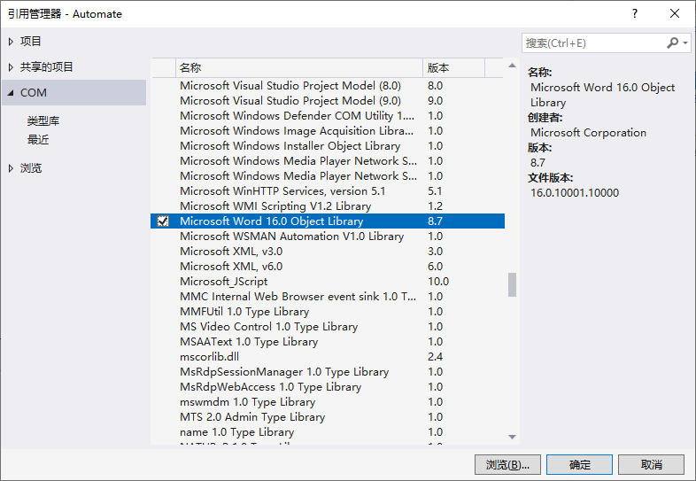

1. 在 "解决方案资源管理器" 中项目列表下的 "依赖性" 处单击鼠标右键。

   

2. 在弹出的菜单中选择 "添加 COM 引用(C)..."

3. 在弹出 "引用管理器" 对话框中的 "名称" 栏出找到 "Microsoft Word16.0 Object Library" 项，勾选其左边的复选框，然后单击 "确定" 按钮即可。

   

> 注意：
>
> 1. 如果在可用的 `COM` 列表中没有看到 `Microsoft Word 16.0 Object Libraray`，很可能是因为没有安装 `Word` 。
> 2. 不同的 `Word` 版本对应的 `COM` 名字也不一样。