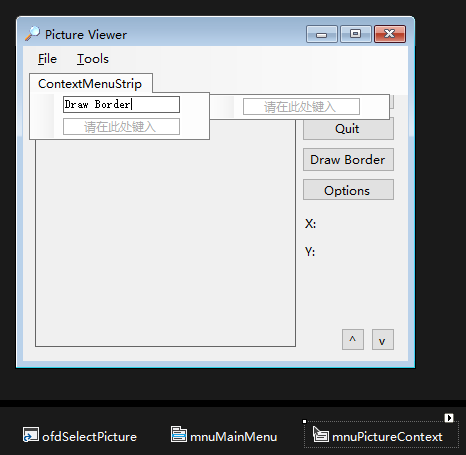

上下文菜单的创建使用的是 `Context Menu Strip`。创建上下文菜单的步骤如下：

1. 在窗体设计器中显示要添加上下文菜单的窗体。

2. 双击工具栏中的 `ContextMenuStrip` 控件，添加一个 `ContextMenuStrip` 到窗体。与 `MenuStrip` 控件一样，`ContextMenuStrip` 控件也显示在窗体设计器底部的面板中。

3. 选择 `ContextMenuStrip` 控件时，靠近窗体的顶部将出现一个供编辑的上下文菜单。单击 "请在此处键入" 框，输入菜单名称，然后按回车键，就可以创建一个菜单项了。

   

4. 单击窗体中需要设置上下文菜单的控件选中它，然后将控件中的 `ContextMenuStrip` 属性改为上下文菜单名称，这样上下文菜单就链接到该控件上了。