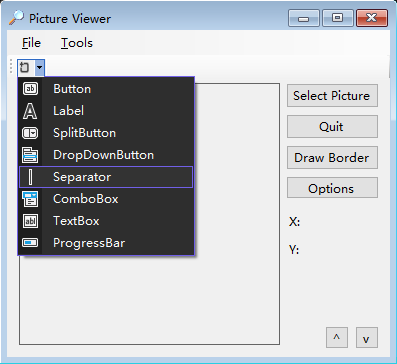

[toc]

### 1. 添加工具栏

1. 在窗体设计器中显示要添加 `Toolbar` 工具栏的窗体。

2. 双击工具箱中的 `ToolStrip` 项，在窗体中添加一个 `ToolStrip` 控件。

   

3. 注意到工具栏出现在菜单的上方。使用过 Windows 程序的人都知道，工具栏应在菜单下方。右击工具栏并在上下文菜单中选择 "置于顶层"，这将工具栏移到菜单下方。

### 2. 使用按钮集合添加工具栏按钮

`ToolStrip` 控件支持一个特殊集合：`Items` 集合。`Items` 集合包含出现在工具栏上的按钮。在 "属性" 窗口中单击 `Items` 属性，然后单击出现的小按钮，将显示 "项集合编辑器"。

也可以通过点击 `Toolbar` 中的下拉按钮选择要添加的菜单类型。

### 3. 为工具栏按钮创建下拉列表

要创建下拉列表，可以在工具栏中添加一个 `DropDownButton`，而不是常规按钮。