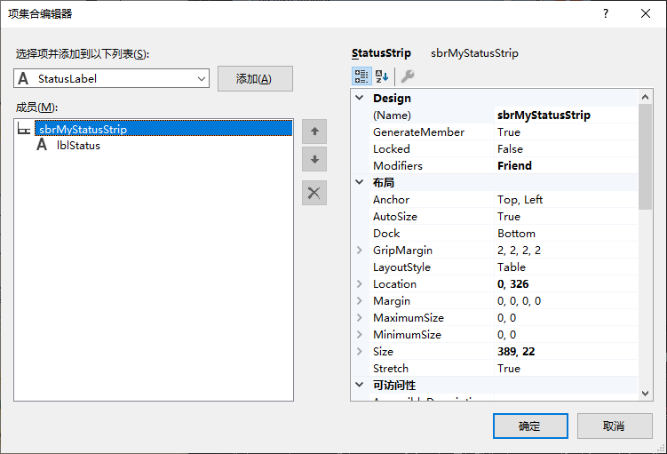
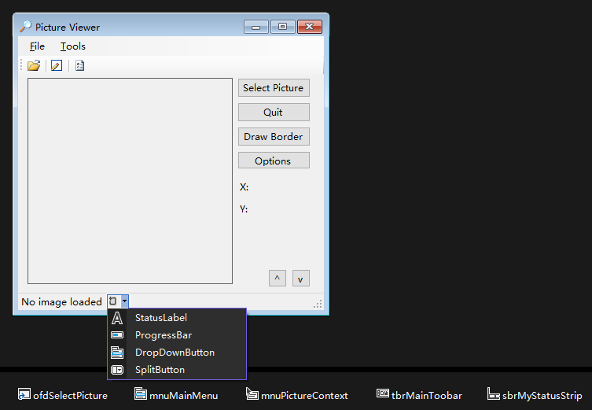

1. 在窗体设计器中选中要添加状态栏的窗体。

2. 双击工具箱中的 `StatusStrip` 项，在窗体中添加一个状态栏。

3. `StatusStrip` 控件支持一个特殊集合：`Items` 集合。`Items` 集合包含出现在工具栏上的按钮。在 "属性" 窗口中单击 `Items` 属性，然后单击出现的小按钮，将显示 "项集合编辑器"。

   
   
   也可以通过点击 `StatusStrip` 中的下拉按钮选择要添加的菜单类型。
   
   