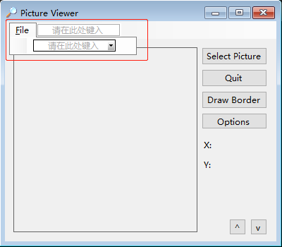

[toc]

### 1. 创建顶级菜单

将菜单添加到窗体中是通过一个控件来实现的，它就是 `Main Strip` 控件。

1. 在添加菜单前需要调整窗口控件位置，在窗口顶部预留出菜单栏位置。

2. 双击 "工具箱" -> "菜单和工具栏" -> "MenuStrip"。

   

3. 单击 "请在此处键入" 字样并输入菜单名（例如 `&File`），然后按回车键。当您开始输入时，Visual Basic 将显示两个新的 "请在此处键入" 框，如下图所示：

   
   
   > 提示：在按钮和其他一些控件的 `Text` 属性中，也可使用 `&` 字符来指定快捷键。例如，如果将按钮的 Text 属性设置为 C&lick Me，则用户按 <kbd>Alt</kbd> + <kbd>L</kbd> 将相当于单击了该按钮。

### 2. 为顶级菜单创建菜单项

1. 单击 `File` 菜单项，在它的下面将显示 “请在此处键入” 框。单击这个 “请在此处键入” 框，输入 `&Open Picture...`，然后按回车键。

   

2. 将鼠标放在菜单项下的 "请在此处键入" 框，将出现一个小的下拉箭头。单击这个箭头，并选择 Separator（分隔条）。下拉箭头用于指定菜单项的类型。可以创建组合框、文本框或分隔条。

   