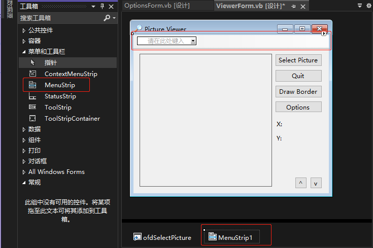
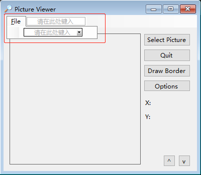

将菜单添加到窗体中是通过一个控件来实现的，它就是 `Main Strip` 控件。

1. 在添加菜单前需要调整窗口控件位置，在窗口顶部预留出菜单栏位置。

2. 双击 "工具箱" -> "菜单和工具栏" -> "MenuStrip"。

   

3. 单击 "请在此处键入" 字样并输入菜单名（例如 `&File`），然后按回车键。当您开始输入时，Visual Basic 将显示两个新的 "请在此处键入" 框，如下图所示：

   
   
   > 提示：