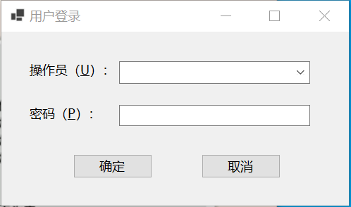

一个 If 语句的 "语句块" 中可以包含另一个 If 语句，这就是 "嵌套"。If 语句的嵌套形式如下所示：

```vb
If 条件表达式1 Then
    语句块1
    If 条件表达式2 Then
        语句块2
    Else
        If 条件表达式4 Then 语句块3 Else 语句块4
    End If
    语句块5
Else
    语句块6
    If 条件表达式3 Then
        语句块7
    End If
    语句块8
End If
```

例如：

```vb
Public Class FrmLogin

    Const MaxTimes As Integer = 3

    Public intMyTimes As Integer
    Private Sub Form1_Load(sender As Object, e As EventArgs) Handles MyBase.Load
        intMyTimes = 1
        cboUserName.Items.Add("管理员")
        cboUserName.Items.Add("操作员 1")
        cboUserName.Items.Add("操作员 2")
    End Sub

    Private Sub CmdOk_Click(sender As Object, e As EventArgs) Handles CmdOk.Click
        If cboUserName.Text <> "" Then
            If FrmPwd.Text = "" Then
                MsgBox("请输入密码！", , "提示窗口")
                FrmPwd.Focus()
            Else
                If FrmPwd.Text <> "11" Then
                    If intMyTimes > MaxTimes Then
                        MsgBox("你无权使用该软件！", , "提示窗口")
                        End
                    Else
                        intMyTimes = intMyTimes + 1
                        MsgBox("密码不正确，请重新输入！", , "提示窗口")
                        FrmPwd.Focus()
                    End If
                Else
                    MsgBox("登录成功！", , "提示窗口")
                End If
            End If
        Else
            MsgBox("操作员不能为空！", , "提示窗口")
            Exit Sub
        End If
    End Sub
End Class
```

运行效果图：



窗口和控件的主要参数：

| 窗体/控件     | Name 属性   | Caption 属性   | Default 属性 | Text 属性 |
| ------------- | ----------- | -------------- | ------------ | --------- |
| Form          | FrmLogin    | 用户登录       |              |           |
| TextBox       | FrmPwd      |                |              | 为空      |
| ComboBox      | cboUserName |                |              | 为空      |
| CommandButton | CmdOk       | 确定           | True         |           |
| CommandButton | CmdCancel   | 取消           |              |           |
| Label         | LabPwd      | 操作员（&U）： |              |           |
| Label         | LabKind     | 密码（&P）：   |              |           |

