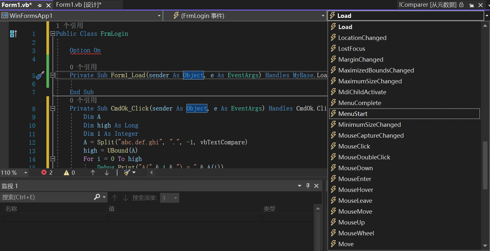

[toc]

事件过程是附加在窗体和控件上的过程。当 VB 中的对象对一个事件的发生做出认定时，便自动用该事件的名称调用该事件的过程。

### 1. 建立事件过程

一个控件的事件过程将控件的（在 Name 属性中规定的）实际名称、下划线（_）和事件名组合起来。例如，如果希望单击一个名为 cmdPlay 的命令按钮之后调用事件过程，则要使用 cmdPlay_Click 过程。

```vb
Private Sub CmdOk_Click(sender As Object, e As EventArgs) Handles CmdOk.Click

End Sub
```

虽然可以自己编写事件过程，但使用 VB 提供的代码过程会更方便，该过程可自动将正确的过程名包括进来。在代码编辑窗口中，从对象下拉列表框中选择一个对象，从事件下拉列表框中选择一个事件，便可创建一个事件过程模板。



> 提示：建议在开始为控件编写事件过程之前就设置好控件的 Name 属性。如果对控件附加一个过程之后有更改控件的名称，那么也必须更改过程的名称，以匹配控件的新名称。当过程名与控件名不符时，过程就称为通用过程。

### 2. 调用事件过程

#### 2.1 使用 Call 语句

使用 `Call` 语句调用事件过程，其语法格式如下所示：

```vb
Call <事件过程名>[(<参数列表>)]
```

例如：

```vb
Private Sub Form_Load()
    Call Command1_Click	' 调用命令按钮的单击事件
End Sub
```

> 注意：使用 Call 语句时，"参数列表" 必须放在括号内。

#### 2.2 直接使用过程名称

直接使用过程名称调用事件过程，语法格式如下所示：

```vb
<事件过程名>[(<参数列表>)]
```

#### 2.3 调用其他模块中的子过程

##### 2.3.1 调用窗体中的子过程

所有窗体模块的外部调用必须指向包含此过程的窗体模块。如果窗体模块 Form1 中包含 MySub 子过程，则可使用下面的语句调用 Form1 窗体中的子过程：

```vb
Call Form1.MySub(参数列表)
```

##### 2.3.2 调用类模块中的子过程

在引用一个类的实例时，不能用类名作限定符。必须首先声明类的实例为对象变量并用变量名引用它。

```vb
Dim DemoClass as NewClass1
DemoClass.SomeSub
```

##### 2.3.3 调用标准模块中的子过程

如果子过程名是唯一的，则不必在调用时加模块名（无论是在模块内，还是在模块外调用）。

如果在两个以上的模块中包含同名的子过程，这时就需要使用模块名来限定了。

例如：

```vb
Module1.CommonName(参数列表)
Module2.CommonName(参数列表)
```

