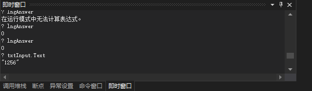

断点本身并不足以对过程进行调试。除断点外，通常还要使用 "即时" 窗口来调试代码。"即时" 窗口是一个 Visual Studio IDE 窗口，通常只在项目处于运行模式时才显示。如果 "即时" 窗口没有显示，可按 <kbd>Ctrl</kbd> + <kbd>Alt</kbd> + <kbd>I</kbd> 快捷键或 "调试" -> "窗口" -> "即时" 菜单显示它。使用 "即时" 窗口，可以键入代码语句，随后 Visual Basic 将立即执行它们。

在 "即时" 窗口中输入下面的语句，然后按回车键：

```
? txtInput.Text
```

`?` 表示打印的意思。

> 注意：只有在执行到断点位置时，才可以使用 "即时" 窗口执行命令，否则将会提示 "在运行模式中无法计算表达式"。



Visual Basic 现在支持动态代码编辑。这意味着可在调试代码时修改它们，而不用停止项目、修改代码再运行以测试修改后的代码。

> 提示：可以使用 "即时" 窗口来修改变量的值。