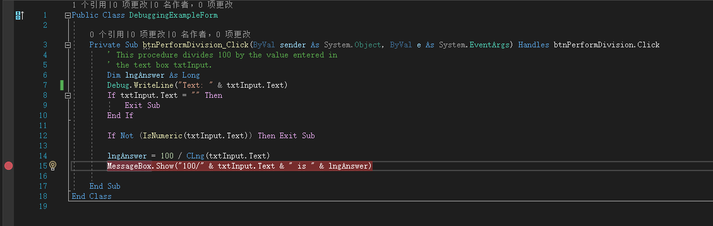
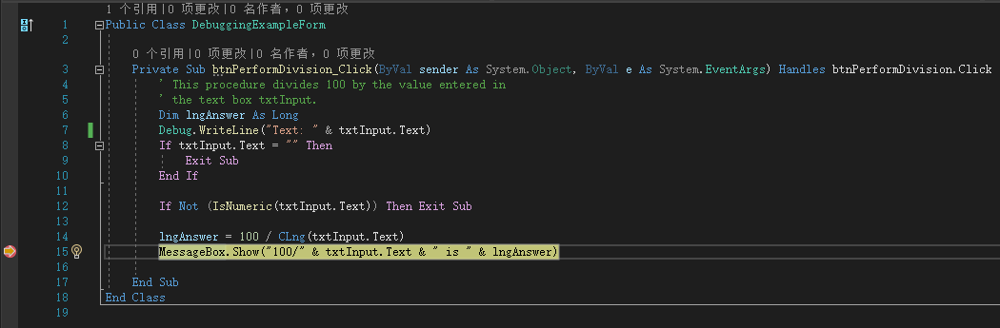

添加断点很简单。只要在要停止执行的语句左边的灰色部分单击。这样做时，Visual Basic 将显示一个红色圆圈，表示这条语句有个断点。要清除这个断点，可以单击红色圆圈。

> 注意：断点可以随项目一起保存。不必在每次打开项目时重设断点。

设置断点后，按 <kbd>F5</kbd> 运行程序。当 Visual Basic 遇到断点时，代码的执行将停止——在有断点的语句执行前，并显示出设置了断点的过程。另外，光标也放在包含当前断点的语句处。注意到断点的红色圆圈上有一个黄色箭头。这个箭头标识了下一条将执行的语句。因为这条语句设置了断点，因此黄色箭头在红色圆圈上（黄色箭头并不总是在红色圆圈上，但它总是出现在将要执行的下一条语句的灰色部分中）。

执行下列步骤，可以重新指定下一条将执行的语句：

1. 单击黄色箭头并按住鼠标。
2. 将黄色箭头拖曳到要执行的语句。
3. 松开鼠标。

当代码在断点处停止执行时，你可在断点处执行如下操作：

| 操作   | 按键                                               | 说明                                                         |
| ------ | -------------------------------------------------- | ------------------------------------------------------------ |
| 继续   | <kbd>F5</kbd>                                      | 在当前断点处继续执行                                         |
| 逐语句 | <kbd>F8</kbd>                                      | 在当前断点处继续执行，并在下一条语句停止。如果当前语句是函数调用，按 <kbd>F8</kbd> 将进入函数并在函数的第一条语句处停止。 |
| 逐过程 | <kbd>Shift</kbd> + <kbd>F8</kbd>                   | 在当前断点处继续执行，并在下一条语句停止。如果当前语句是函数调用，整个函数都将执行；并在函数调用后的语句处停止执行 |
| 跳出   | <kbd>Ctrl</kbd> + <kbd>Shift</kbd> + <kbd>F8</kbd> | 运行当前过程的所有语句。然后在调用当前过程的语句后面的语句处停止 |

