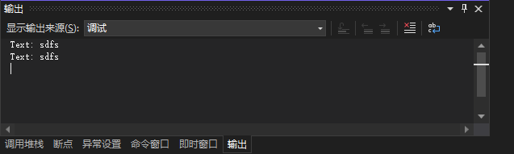

可以在调试期间在代码中打印数据。为此，可使用 `Debug` 对象的 `WriteLine()` 方法，如下所示：

```vb
Debug.WriteLine(lngInteger1 + lngInteger2)
```

使用方法 `Debug.WriteLine()` 时，括号中的内容将打印到 "输出" 窗口中。可以打印字母文本、数字、变量和表达式。在需要知道变量的值，但不想使用断点停止执行代码时， `Debug.WriteLine()` 最有用。

