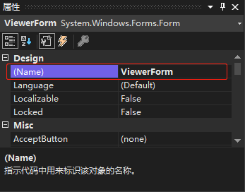
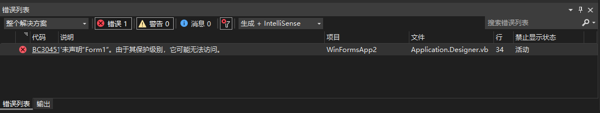

[toc]

### 1. 问题描述

1. 选择要修改名称的窗体。

2. 在窗体属性窗口中，修改 `(Name)` 选项的值。

   

3. 然后编译运行程序，编译运行报错。

### 2. 报错信息



### 3. 解决办法

1. 打开 `ApplicationEvents.vb` 文件中 `MyApplication` 类的 `onCreateMainForm()` 方法

   

2. 将 `onCreateMainForm()` 方法中 `Me.MainForm` 的值设置成重命名后的启动窗口名称。

   ```vb
   Protected Overrides Sub OnCreateMainForm()
       Me.MainForm = ViewerForm
   End Sub
   ```