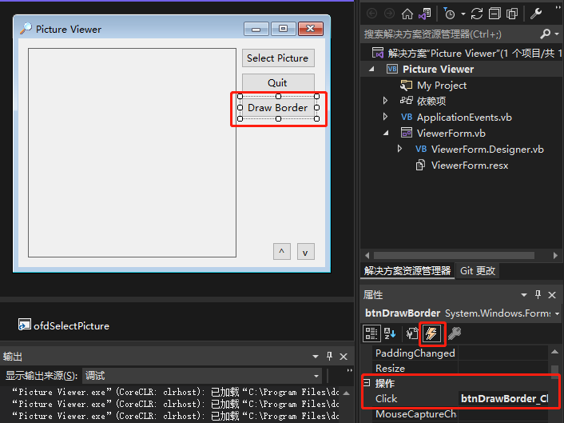

[toc]

### 问题前提条件

1. 已存在控件已经添加事件处理方法，比如点击事件。
2. 通过复制该控件创建另外一个控件。

### 问题现象

双击复制生成的控件，进入点击事件代码编辑窗口，这时系统会在已存在的点击事件中关联该控件的点击事件，例如：

```vb
Private Sub btnQuit_Click(sender As Object, e As EventArgs) Handles btnQuit.Click, btnDrawBorder.Click
    ' Close the window and exit the application
    Me.Close()
End Sub
```

### 解决方法

在窗体设计窗口中，选择复制生成的控件，在控件的属性窗口中，切换至事件属性项，然后删除 `Click` 的值，最后双击复制生成的控件，系统将会独立生成一个点击事件。

