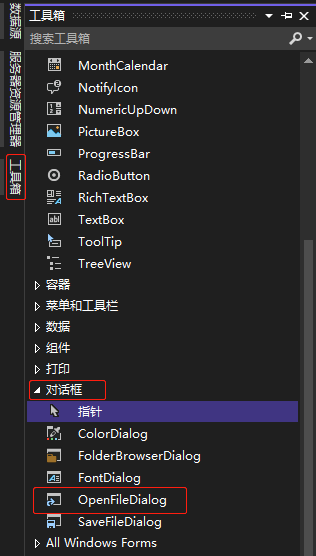
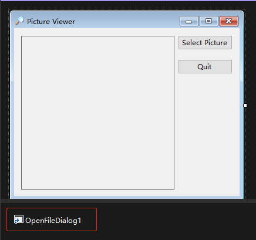

[toc]

1. 点击 `Visual Studio 2022` 应用界面左边栏的 "工具箱" 按钮，在弹出窗口中选中 "对话框" 项下的 `OpenFileDialog` 控件。

   

2. 在需要放置的目标窗体中点击鼠标左键即可添加 `OpenFileDialog` 控件（也可以将 `OpenFileDialog` 控件拖动到窗体）。

   

   > 注意
   >
   > 由于 `OpenFileDialog` 属于不可见控件，所以添加后会显示在窗体下方。