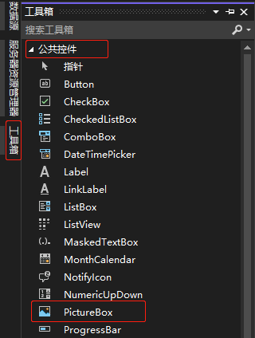

[toc]

### 1. 通过工具箱添加

在左边栏中点击 "工具箱" 按钮，在 "工具箱" 中选择 "公共控件"，在公共控件列表中点击 `PictureBox` 项，然后在要添加的窗体中相应位置点击鼠标左键即可添加。

### 2. 通过拷贝添加

右击已存在的 `PictureBox` 控件，并从弹出的菜单中选择 "复制" 命令。接下来，在窗体的任意处右击并从窗体的快捷菜单中选择 "粘贴"（也可使用键盘 <kbd>Ctrl</kbd> + <kbd>C</kbd> 组合键进行复制，用 <kbd>Ctrl</kbd> + <kbd>V</kbd> 组合键进行粘贴）命令。新按钮出现在窗体中央，且默认被选中。

> 注意
>
> 通过复制添加的控件与原控件属性几乎相同，但名称已重新设置。

